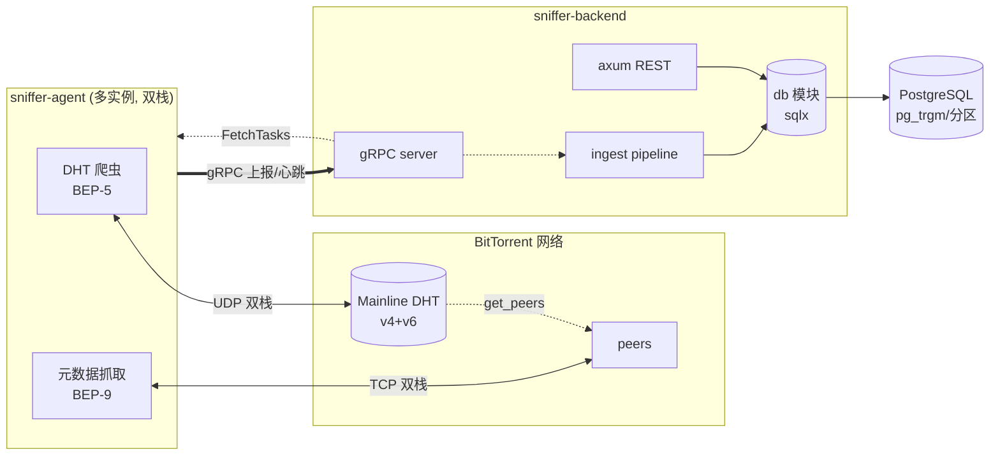
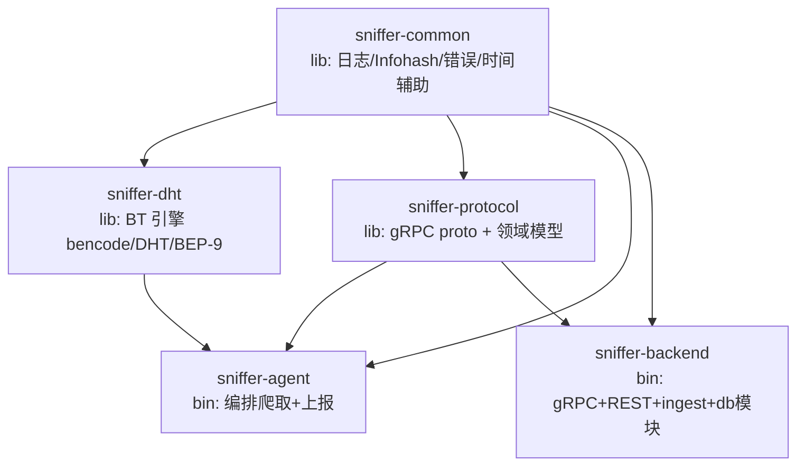
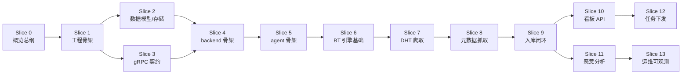

# Slice 0 — 项目概览与架构总纲

> 本文档是 `docs/` 的入口与索引。后续每个垂直切片落在自己的子文件夹下，包含一份 `index.md` 主文档以及可能的若干深入子文档（如路由表细化、BEP-9 状态机等）。

## 1. 系统定位

**Magnet-Sniffer** 是一个分布式 BitTorrent 全网信息嗅探系统。部署在多个网络位置的 **agent** 被动爬取 DHT、用 BEP-9 只抓种子元数据（不下载文件内容），经 gRPC 上报给中心 **backend**，后者入库 PostgreSQL 并通过 REST API 暴露查询、统计与恶意行为分析能力。全栈 **IPv4/IPv6 双栈**。

两个并行用途:

1. **个人磁力链接搜索数据库** —— 索引全网种子的磁力链接与 metadata，支持名称/文件模糊搜索与详情查看。
2. **全网 BT 网络分析** —— 观测 DHT 拓扑、客户端/地域分布、swarm 健康，识别恶意行为（Sybil、DHT 投毒、伪种子、坏块注入、恶意软件分发、DDoS 反射节点等）。

**非目标（边界）**：

- 不做文件内容下载与分发。
- 不做 BT 客户端。
- 不对外提供下载服务。

## 2. 架构拓扑

### Crate 拓扑（5 个，无环依赖）

| Crate | 类型 | 职责 |
| --- | --- | --- |
| `sniffer-common` | lib | 日志、`Infohash` 类型、共享错误、配置/`time` 辅助。轻量，无 tonic/sqlx |
| `sniffer-protocol` | lib | gRPC proto + tonic codegen + 双方共享领域模型（跨两端，必须独立） |
| `sniffer-dht` | lib | BT 引擎：bencode(Bendy)、DHT(BEP-5, v4/v6)、peer wire(BEP-3/10)、ut_metadata(BEP-9)。纯库，独立可测 |
| `sniffer-agent` | bin | 编排爬取 + 元数据抓取 + 去重 + 限速 + gRPC 上报 |
| `sniffer-backend` | bin | gRPC server + axum REST + ingest pipeline + agent 管理 + 分析 + 任务下发 + **内部 `db` 模块（sqlx DAL）** |

**分层决策**：

- `sniffer-dht` 只依赖 `sniffer-common`，产出原始观测，由 agent 转成 protocol 消息 —— BT 引擎可独立单测，不耦合 wire contract。
- 存储不独立 crate，作为 `sniffer-backend` 内部 `db` 模块。唯一消费者是 backend，独立 crate 是过度设计；DAL 作为模块仍可单测，不需拉起 HTTP/gRPC 栈。

## 3. 技术栈与版本锁定

| 维度 | 选型 | 说明 |
| --- | --- | --- |
| 语言/工具链 | Rust 1.96.0，edition 2024，resolver 3 | 见 [rust-toolchain.toml](../../rust-toolchain.toml) |
| 运行时 | tokio (full) | |
| 后端 Web | axum + tower / tower-http | |
| RPC | tonic + prost | gRPC over HTTP/2 |
| 存储 | PostgreSQL + sqlx | async 原生 SQL + migration。**不用 toasty** |
| bencode | **Bendy** | 零分配、流式、受控 |
| BT 协议 | DHT + 最小 peer 协议自实现于 `sniffer-dht` | 不做完整 piece 下载 |
| 网络 | IPv4/IPv6 双栈 | DHT(UDP) + peer(TCP) 双栈监听与连接 |
| 日志 | tracing + tracing-subscriber + tracing-appender | 已实现分层日志 |
| 时间 | **`time`**（全栈统一，不引入 chrono） | 已随 tracing 引入；sqlx 原生支持；补 features formatting/parsing/macros/serde |
| 质量 | deny unsafe_code；clippy all=warn（白名单）；release LTO+strip；rustfmt max_width=100 | |

## 4. 避免污染 BT 网络的伦理边界（总纲）

系统设计为**被动的、只取元数据的临时参与者**：

1. **被动 DHT 爬取**：find_node/get_peers 遍历真实路由表，单实例单 node id，**诚实应答**进来的查询（回馈网络），**不大规模伪造 announce_peer**。
2. **只取 metadata**：BEP-9 只交换 info dict，**零文件数据传输**，拿到即断。
3. **限速 + 短连接**：全局与 per-peer 令牌桶限速，单 peer 最小间隔，有界 outstanding 查询，连上即断。
4. **announce_peer 保守**：仅当 agent 确认有 public_ip 时可配开启，默认关闭（NAT 后宣示不可达地址会污染 DHT）。
5. **双栈诚实**：v4/v6 各自单 node id，各自诚实应答。

**验证底线**：抓包/日志确认零 piece 数据传输、连接快速断开。

## 5. 实施切片索引（垂直切片，每片一个文件夹）

| 切片 | 文件夹 | 状态 |
| --- | --- | --- |
| Slice 0 | [`docs/00-overview/`](../00-overview/index.md) | ✅ 已落盘 |
| Slice 1 | [`docs/01-skeleton/`](../01-skeleton/index.md) | ✅ 已落盘 |
| Slice 2 | [`docs/02-storage/`](../02-storage/index.md) | ✅ 已落盘 |
| Slice 3 | [`docs/03-protocol/`](../03-protocol/index.md) | ✅ 已落盘 |
| Slice 4 | [`docs/04-backend-skeleton/`](../04-backend-skeleton/index.md) | ✅ 已落盘 |
| Slice 5 | [`docs/05-agent-skeleton/`](../05-agent-skeleton/index.md) | ✅ 已落盘 |
| Slice 6 | [`docs/06-bt-engine/`](../06-bt-engine/index.md) | ✅ 已落盘 |
| Slice 7 | `docs/07-dht-crawl/` | 待讨论 |
| Slice 8 | `docs/08-metadata-fetch/` | 待讨论 |
| Slice 9 | `docs/09-ingest-pipeline/` | 待讨论 |
| Slice 10 | `docs/10-dashboard-api/` | 待讨论 |
| Slice 11 | `docs/11-malicious-analysis/` | 待讨论 |
| Slice 12 | `docs/12-task-dispatch/` | 待讨论 |
| Slice 13 | `docs/13-ops-observability/` | 待讨论 |
