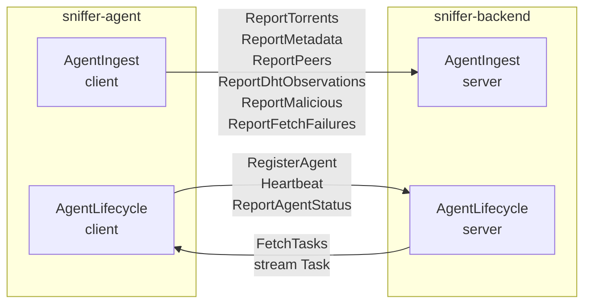
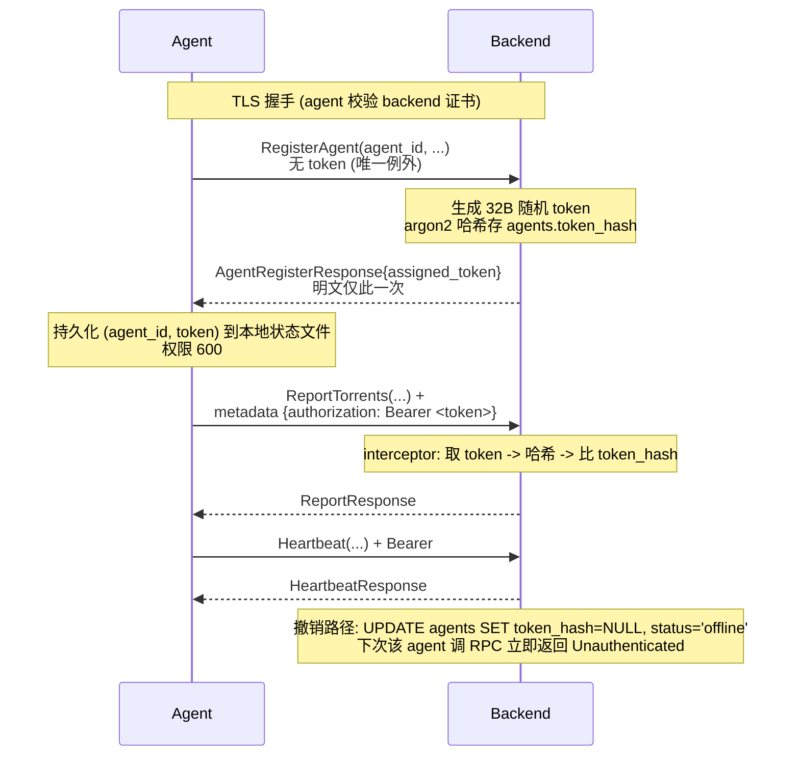

# Slice 3 — gRPC 契约与领域模型

> 上一片：[Slice 2 — 数据模型与存储层](../02-storage/index.md)

## 1. 目标与范围

把 `sniffer-protocol` crate 从 Slice 1 留下的"空壳 + 占位 build.rs"补成**完整可用的线契约层**：proto 文件、tonic 双向 codegen、共享领域模型的纯 Rust 结构体（pb ↔ model 互转）、错误码约定、版本演进规则。

**范围内**：

- 一份 `proto/sniffer.proto`（包 `sniffer.v1`），两个 service：`AgentIngest`（上报）+ `AgentLifecycle`（注册/心跳/任务）。
- 完整 message 定义对齐 Slice 2 数据库 schema 与 `sniffer-common` 类型。
- proto 字段一律加业务注释（自解释字段例外），与 SQL 注释规则一致。
- `sniffer-protocol/src/`：`pb`（codegen 输出）+ `model`（手写纯 Rust 领域模型）+ `convert`（双向转换）。
- 鉴权：TLS + Bearer Token；token 在 PG 哈希存储；日志过滤 authorization header。
- 错误模型：业务错误用 status code + structured detail；批次内单条拒绝走 `ReportResponse.detail`。
- 批次大小、流式 vs unary 的选择标准。
- proto 演进策略（字段编号约定、reserved、枚举扩展）。
- 真接 `tonic-build`（Slice 1 占位 build.rs 这次填实），生成 client + server stub。

**范围外**：service trait 的实际实现（agent 端 Slice 5，backend 端 Slice 4）；ingest pipeline（Slice 9）；任务下发业务逻辑（Slice 12）；TLS 证书的具体颁发流程（Slice 4 接入时定）；mTLS（Slice 13 可选加固）。

## 2. 整体契约总览



两个 service 的边界规则：

- **`AgentIngest`** 处理"agent 观测到的事实"。所有方法 unary、批次化、幂等（重发同批次不产生重复入库）。
- **`AgentLifecycle`** 处理"agent 与 backend 的关系"。包含会话级状态（注册、心跳）+ 控制下行（任务）。`FetchTasks` 是唯一的 server-streaming RPC。

## 3. 文件组织

```text
sniffer-protocol/
├── Cargo.toml
├── build.rs                    # 真接 tonic-build, 替换 Slice 1 占位
├── proto/
│   └── sniffer.proto           # 唯一 proto 源
└── src/
    ├── lib.rs                  # pub mod pb; pub mod model; pub mod convert; re-export 常用类型
    ├── pb.rs                   # tonic::include_proto!("sniffer.v1");
    ├── model/                  # 手写纯 Rust 领域模型 (用 sniffer-common 类型)
    │   ├── mod.rs
    │   ├── torrent.rs
    │   ├── peer.rs
    │   ├── dht.rs
    │   ├── agent.rs
    │   ├── task.rs
    │   └── malicious.rs
    ├── convert/                # pb <-> model 双向转换 (TryFrom)
    │   ├── mod.rs
    │   ├── util.rs             # 时间/IP/option 辅助
    │   ├── torrent.rs
    │   ├── peer.rs
    │   ├── dht.rs
    │   ├── agent.rs
    │   ├── task.rs
    │   └── malicious.rs
    └── error.rs                # ProtoError(thiserror)
```

**两层类型设计的理由**：

- `pb::*` 是 prost 自动生成的，字段都是 `String` / `i64` / `Vec<u8>` / `Option<...>` / proto 枚举的 `i32`。直接用会让上层代码到处 `parse::<Uuid>()`、`Infohash::from_hex()`、`Option::ok_or(...)`。
- `model::*` 是手写的，字段是 `Infohash` / `AgentId` / `OffsetDateTime` / Rust 强枚举。这是 agent/backend 业务逻辑使用的形态。
- `convert::*` 集中所有 `TryFrom<pb::X> for model::X` / `From<model::X> for pb::X`。校验在转换层一次性完成；service handler 拿到的就是已校验的强类型。

## 4. proto 文件设计

### 4.1 全局公约

| 项 | 规则 |
| --- | --- |
| 包名 | `sniffer.v1`（`v2` 保留给将来 v2 infohash wire 不兼容时升包） |
| 文件分布 | 单文件 `sniffer.proto`，按 service / message 分节注释；不拆多文件 |
| 命名 | message PascalCase；字段 snake_case；枚举 PascalCase + 值 `SCREAMING_SNAKE_CASE` |
| 时间 | 一律 `int64` 带 `_unix_ms` 后缀，毫秒精度，UTC（不引入 `google.protobuf.Timestamp`） |
| infohash | `string infohash_hex`（lowercase 40 字符；与 PG TEXT 表示对齐） |
| ID（uuid） | `string` 形式（带破折号 lowercase） |
| IP | `string`（点分十进制 v4 / 标准 v6）；不用 `bytes` |
| 枚举 | 第 0 值都是 `XXX_UNSPECIFIED`，作为 sentinel；转换层把它视为 `MissingField` |
| 字段编号 | 1-15 留给热路径字段（编码 1 字节 tag）；新增一律追加；删除走 `reserved`，**永不复用** |
| 大小限制 | 单 message ≤ 4MB（tonic 默认）；批次条数上限见各 message 注释 |
| **注释规则** | **业务字段一律 `// ...` 注释（与 SQL 同标准）；自解释字段例外：`*_unix_ms` / 显然语义的 `id` 字段** |

### 4.2 完整 proto 内容

```proto
syntax = "proto3";

// Magnet-Sniffer agent <-> backend wire contract.
// 演进规则: 加字段一律新编号; 删字段必须 reserved; 包版本 v1 保持 wire 兼容,
// 不兼容变更 (如 infohash v2 双 hash) 走 sniffer.v2 新包。
package sniffer.v1;

// ============================================================
// Common scalar types
// ============================================================

// 无载荷占位消息: 用于无入参的 RPC.
message Empty {}

// 通用上报响应: 批次成功/失败统计.
//
// 单条记录被拒不抛 gRPC Status, 走 `detail` 列表; 整批失败 (鉴权/限流) 才抛 Status.
message ReportResponse {
    // 成功入队的条数
    int32  accepted        = 1;
    // 被服务端校验拒绝的条数
    int32  rejected        = 2;
    // rejected > 0 时的概述; 详细列表见 detail
    string rejected_reason = 3;
    // 单条拒绝详情; 可能为空
    repeated RejectedItem detail = 4;
    // 服务端分配的批次序号 (用于 agent 端幂等观测)
    int64  server_seq      = 5;
}

message RejectedItem {
    // 在批次内的下标 (从 0 起)
    int32  index   = 1;
    // 拒绝原因, e.g. "invalid infohash hex", "missing required field: name"
    string reason  = 2;
}

// ============================================================
// AgentIngest: agent -> backend 数据上报
// ============================================================

service AgentIngest {
    rpc ReportTorrents(TorrentBatch)               returns (ReportResponse);
    rpc ReportMetadata(MetadataBatch)              returns (ReportResponse);
    rpc ReportPeers(PeerBatch)                     returns (ReportResponse);
    rpc ReportDhtObservations(DhtObservationBatch) returns (ReportResponse);
    rpc ReportMalicious(MaliciousBatch)            returns (ReportResponse);
    rpc ReportFetchFailures(FetchFailureBatch)     returns (ReportResponse);
}

// ----------- 4.2.1 Torrent 主记录 (DHT 发现的 infohash 即可上报, 不要求已抓 metadata) -----------
message TorrentRecord {
    // 40 字符 lowercase sha1 hex (v1); v2 升级时改 sniffer.v2.TorrentRecord
    string infohash_hex      = 1;
    // metadata 已抓时填; 未抓时空串 (proto3 不发 null)
    string name              = 2;
    // 0 = metadata 未抓
    int64  size_bytes        = 3;
    // 0 = metadata 未抓
    int32  file_count        = 4;
    // info dict 中声明的文本编码; 空串 = 未声明
    string encoding          = 5;
    // BEP-27 私有种子标志; 默认从公开搜索 API 过滤掉
    bool   is_private        = 6;
    // 该 infohash 在 agent 处的发现路径
    DiscoveryMethod discovery_method = 7;
    int64  observed_at_unix_ms = 8;
}

enum DiscoveryMethod {
    // proto3 sentinel; 转换层视为 MissingField
    DISCOVERY_METHOD_UNSPECIFIED   = 0;
    // 通过 DHT get_peers 响应中发现 infohash
    DISCOVERY_METHOD_DHT_GET_PEERS = 1;
    // 通过收到的 announce_peer 查询发现 infohash
    DISCOVERY_METHOD_DHT_ANNOUNCE  = 2;
    // 由 backend 任务下发指定爬取
    DISCOVERY_METHOD_TASK          = 3;
}

message TorrentBatch {
    // 推荐每批 ≤ 500 条 (单条 ~150B)
    repeated TorrentRecord records = 1;
}

// ----------- 4.2.2 Metadata 详细记录 (BEP-9 抓到 info dict 后) -----------
message MetadataRecord {
    string infohash_hex   = 1;
    // UTF-8 化后的种子名 (agent 按 encoding 字段先解码)
    string name           = 2;
    int64  size_bytes     = 3;
    int32  file_count     = 4;
    // info dict 中声明的文本编码; 空串 = 未声明
    string encoding       = 5;
    // BEP-27 私有种子标志
    bool   is_private     = 6;
    // 完整文件树 (落入 PG torrents.files_json)
    repeated FileEntry files = 7;
    // info dict announce-list 中的 tracker URL (规范化前的原始字符串; backend 入库时规范化)
    repeated string trackers = 8;
    // 提供 metadata 的 peer IP
    string fetched_from_peer_ip   = 9;
    int32  fetched_from_peer_port = 10;
    int64  fetched_at_unix_ms     = 11;
}

message FileEntry {
    // 路径片段用 '/' 拼接, 已 UTF-8 化
    string path   = 1;
    int64  length = 2;
}

message MetadataBatch {
    // 推荐每批 ≤ 100 条 (单条较大, 含 files 数组可达 KB 级)
    repeated MetadataRecord records = 1;
}

// ----------- 4.2.3 Peer 观测 (附属于 infohash 的 swarm 成员) -----------
message PeerRecord {
    string infohash_hex   = 1;
    // v4 点分十进制 / v6 标准格式
    string ip             = 2;
    int32  port           = 3;
    // agent 已解析 BT peer_id 前缀; 未识别时空串 (e.g. "qBittorrent 4.5.0")
    string client_name    = 4;
    int64  observed_at_unix_ms = 5;
}

message PeerBatch {
    // 推荐每批 ≤ 1000 条
    repeated PeerRecord records = 1;
}

// ----------- 4.2.4 DHT 观测 -----------
//
// 注意: agent 不上报 find_node 与 ping (前者是路由噪声, 后者纯活性探测).
//        仅记录 get_peers / announce_peer.
message DhtObservation {
    // 4 字节 node id 前缀 (Sybil/diversity 分析够用, 不发全量 20B)
    bytes  node_id_prefix     = 1;
    string ip                 = 2;
    int32  port               = 3;
    // 仅这两个值; ping/find_node 不上报
    DhtQueryType query_type   = 4;
    DhtDirection direction    = 5;
    // 仅 GET_PEERS / ANNOUNCE_PEER 有值; 空串 = 不存在
    string infohash_hex       = 6;
    int64  observed_at_unix_ms = 7;
}

enum DhtQueryType {
    DHT_QUERY_TYPE_UNSPECIFIED    = 0;
    // GET_PEERS 查询 (寻找某 infohash 的 swarm)
    DHT_QUERY_TYPE_GET_PEERS      = 1;
    // ANNOUNCE_PEER 查询 (peer 在 swarm 内宣示存在)
    DHT_QUERY_TYPE_ANNOUNCE_PEER  = 2;
    // 注意: FIND_NODE / PING 不在此枚举内 -- agent 不上报
}

enum DhtDirection {
    DHT_DIRECTION_UNSPECIFIED = 0;
    // 收到对方发起的查询/响应
    DHT_DIRECTION_IN  = 1;
    // 我方主动发起
    DHT_DIRECTION_OUT = 2;
}

message DhtObservationBatch {
    // 推荐每批 ≤ 2000 条 (单条 ~50B, 高频写入)
    repeated DhtObservation records = 1;
}

// ----------- 4.2.5 恶意行为标记 (Slice 11) -----------
message MaliciousFlag {
    MaliciousCategory category = 1;
    // 可空 (空串)
    string peer_ip            = 2;
    // 可空 (空串)
    string infohash_hex       = 3;
    // 规则置信度 0..1
    float  confidence         = 4;
    // agent 端规则引擎生成的 jsonb 文本; backend 直存 malicious_events.evidence
    string evidence_json      = 5;
    int64  observed_at_unix_ms = 6;
}

enum MaliciousCategory {
    MALICIOUS_CATEGORY_UNSPECIFIED          = 0;
    // 单 IP 多 node id / 可预测 id 等 Sybil 模式
    MALICIOUS_CATEGORY_SYBIL                = 1;
    // 异常 get_peers 应答 / 虚假 peer 列表注入等
    MALICIOUS_CATEGORY_DHT_POISONING        = 2;
    // size/name 异常 / 同 infohash 异质 metadata 申明
    MALICIOUS_CATEGORY_FAKE_TORRENT         = 3;
    // 持续上送校验失败的 piece (受限于不下载 payload, 规则较保守)
    MALICIOUS_CATEGORY_BAD_CHUNK            = 4;
    // metadata 命中已知恶意软件 hash 库
    MALICIOUS_CATEGORY_MALWARE_DISTRIBUTION = 5;
    // DHT UDP 放大攻击节点
    MALICIOUS_CATEGORY_DDOS_REFLECTOR       = 6;
}

message MaliciousBatch {
    // 推荐每批 ≤ 200 条
    repeated MaliciousFlag records = 1;
}

// ----------- 4.2.6 抓取失败 (BEP-9 fetch 失败上报) -----------
message FetchFailureRecord {
    string infohash_hex   = 1;
    // 可空
    string peer_ip        = 2;
    int32  peer_port      = 3;
    FetchFailureKind kind = 4;
    // 自由文本; 可空
    string detail         = 5;
    int64  occurred_at_unix_ms = 6;
}

enum FetchFailureKind {
    FETCH_FAILURE_KIND_UNSPECIFIED            = 0;
    FETCH_FAILURE_KIND_CONNECT_TIMEOUT        = 1;
    // BEP-3 握手失败 / BEP-10 扩展握手失败
    FETCH_FAILURE_KIND_HANDSHAKE_FAIL         = 2;
    // peer 不支持 ut_metadata 扩展
    FETCH_FAILURE_KIND_NO_UT_METADATA         = 3;
    // metadata size 超过安全阈值 (防止恶意 peer 灌注)
    FETCH_FAILURE_KIND_METADATA_SIZE_OVERFLOW = 4;
    // 抓到的 info dict sha1 与 infohash 不符 (peer 伪造)
    FETCH_FAILURE_KIND_SHA1_MISMATCH          = 5;
    FETCH_FAILURE_KIND_PEER_RESET             = 6;
    FETCH_FAILURE_KIND_OTHER                  = 99;
}

message FetchFailureBatch {
    // 推荐每批 ≤ 1000 条
    repeated FetchFailureRecord records = 1;
}

// ============================================================
// AgentLifecycle: 注册 / 心跳 / 任务
// ============================================================

service AgentLifecycle {
    rpc RegisterAgent(AgentRegisterRequest) returns (AgentRegisterResponse);
    rpc Heartbeat(HeartbeatRequest)         returns (HeartbeatResponse);
    rpc ReportAgentStatus(AgentStatusReport) returns (Empty);
    rpc FetchTasks(FetchTasksRequest)       returns (stream Task);
}

message AgentRegisterRequest {
    // agent 自生成的 uuid v4 (小写带破折号)
    string agent_id        = 1;
    string hostname        = 2;
    // crate version, e.g. "0.1.0"
    string version         = 3;
    // 0 = 未监听 v4
    int32  listen_port_v4  = 4;
    // 0 = 未监听 v6
    int32  listen_port_v6  = 5;
    // agent 自报告的公网 IP; 空串 = NAT 后 / 不可知
    string public_ip_v4    = 6;
    // 同上
    string public_ip_v6    = 7;
    // 自报告 region 标签, e.g. "cn-shanghai" (Slice 13 才落库)
    string region          = 8;
    // 能力清单, e.g. ["announce_peer","ipv6","public_ip"]
    repeated string capabilities = 9;
    int64  registered_at_unix_ms = 10;
}

message AgentRegisterResponse {
    // backend 颁发的 session token; agent 后续 RPC 通过 metadata "authorization: Bearer <token>" 携带.
    // 注意: token 只在此处明文出现; backend 端只存哈希
    string assigned_token  = 1;
    // agent 校时参考 (避免时钟偏差导致心跳判定错误)
    int64  server_time_unix_ms = 2;
    // 服务端建议的心跳周期 (默认 30 秒); agent 应遵循
    int32  heartbeat_interval_secs = 3;
}

message HeartbeatRequest {
    string agent_id              = 1;
    int64  ts_unix_ms            = 2;
    int64  uptime_secs           = 3;
    // 计数器/水位快照, 落入 agent_metrics_history.metrics jsonb
    AgentMetricsSnapshot metrics = 4;
}

message HeartbeatResponse {
    int64 server_time_unix_ms = 1;
    // 服务端可调整下次心跳间隔 (背压机制)
    int32 next_interval_secs  = 2;
}

// agent 当前内部计数器/水位快照. 字段会随系统演进新增, 整体存为 jsonb.
message AgentMetricsSnapshot {
    int64 torrents_seen     = 1;
    int64 metadata_fetched  = 2;
    int64 peers_seen        = 3;
    int64 dht_queries_out   = 4;
    int64 dht_queries_in    = 5;
    // agent 本地 DashMap 去重缓存大小
    int64 cache_size        = 6;
    // 限速器状态自由文本快照, e.g. "global=80% v4=30% v6=10%"
    string rate_limit_state = 7;
    // "healthy" / "degraded" / "stalled"
    string health           = 8;
}

// 较重的状态信息, 频率低于 Heartbeat (默认每 5 分钟一次或变更触发).
message AgentStatusReport {
    string agent_id        = 1;
    string version         = 2;
    // 可能因 NAT 重协商而变化
    string public_ip_v4    = 3;
    // 同上
    string public_ip_v6    = 4;
    repeated string capabilities = 5;
    int64  reported_at_unix_ms = 6;
}

// 任务下行流 (Slice 12 真正使用; Slice 4 阶段 backend 实现可立即返回空 stream).
message FetchTasksRequest {
    string agent_id        = 1;
    // agent 同时能处理的最大任务并发; 0 = 服务端默认
    int32  max_concurrent  = 2;
}

message Task {
    string task_id      = 1;
    TaskKind kind       = 2;
    // jsonb 形态, 由具体 kind 解释; e.g. CRAWL_INFOHASH 时为 {"infohash_hex":"..."}
    bytes  payload_json = 3;
    int64  deadline_unix_ms = 4;
}

enum TaskKind {
    TASK_KIND_UNSPECIFIED       = 0;
    // 定向爬取一个 infohash (用户从 magnet URI 投递)
    TASK_KIND_CRAWL_INFOHASH    = 1;
    // 暂停 agent 的 DHT 爬取
    TASK_KIND_PAUSE             = 2;
    // 恢复
    TASK_KIND_RESUME            = 3;
    // 推送配置变更 (如限速调整)
    TASK_KIND_UPDATE_CONFIG     = 4;
    // 主动 announce 一个 infohash 提升 swarm 可见性
    TASK_KIND_ANNOUNCE_INFOHASH = 5;
}
```

### 4.3 字段对齐 Slice 2 schema

| proto 字段 | DB 字段 | 转换 |
| --- | --- | --- |
| `TorrentRecord.infohash_hex` | `torrents.infohash` | string → `Infohash::from_hex` → 写 PG TEXT |
| `MetadataRecord.files[]` | `torrents.files_json` | proto repeated → `Vec<FileEntry>` → serde_json 序列化 jsonb |
| `MetadataRecord.trackers[]` | `trackers` + `torrent_trackers` | 拆 URL，规范化 scheme，UNIQUE upsert |
| `PeerRecord.client_name` | `peers.client_name` | 直通；空串 → NULL |
| `DhtObservation.node_id_prefix bytes(4)` | `dht_observations.node_id_prefix bytea` | 直通 |
| `MaliciousFlag.evidence_json` | `malicious_events.evidence` | string → `serde_json::from_str` → jsonb |
| `*_unix_ms int64` | `*_at timestamptz` | i64 ms → `OffsetDateTime::from_unix_timestamp_nanos(... * 1_000_000)` |
| `AgentMetricsSnapshot` | `agent_metrics_history.metrics jsonb` | proto message → `serde_json::to_value` 整体存 jsonb |

> `metrics` 走 jsonb 而非每字段单列：metric 形态会随系统演进，jsonb 给前端看板留扩展空间，避免每加一个 metric 都改 schema。

## 5. 鉴权与传输安全

### 5.1 整体流程



### 5.2 决策依据

**TLS + Bearer Token，不上 mTLS**。理由：

- TLS 本身就防 MITM —— 加密通道下 token 永远不在 wire 上明文出现；agent 校验 backend 证书避免被伪造服务端钓鱼。
- mTLS 多挡的攻击面（端口扫描隐藏、私钥不可复制）对当前部署（agent 分布在多个网络位置）价值不足以抵消证书生命周期管理成本。
- 演进路径开放：proto 完全不变，未来要切 mTLS 只需改两端 tonic TLS 配置。

### 5.3 落地清单（Slice 4 实施）

backend 端：

1. tonic `Server::builder().tls_config(...)` **必开 TLS**；不接受明文 gRPC。生产环境用 LetsEncrypt 或私有 CA 签发的服务器证书；开发环境用自签证书 + 项目根 `certs/` 目录（gitignore）。
2. `agents.token_hash text NOT NULL` 列（Slice 2 已留 `agents` 表，Slice 4 实施时加这列的 migration），用 argon2id 哈希。
3. tonic `Interceptor`：从 `Request::metadata().get("authorization")` 取 token → argon2 比对 → 注入 `agent_id` 到 `Request::extensions()` 供 handler 使用。
4. tracing layer 过滤 `authorization` header 不打印（避免 token 进日志）。
5. token 撤销：API `DELETE /api/v1/agents/:id/token` 设 `token_hash=NULL`，下次该 agent 调 RPC 即 `Unauthenticated`，触发它重新 `RegisterAgent`。

agent 端：

1. tonic `Channel::builder(uri).tls_config(...)` **必开 TLS**；**不**禁用证书校验（不写 `danger_accept_invalid_certs`）。
2. 本地状态文件 `agent-state.json`（权限 600）存 `(agent_id, token)`；首次启动若文件不存在则跑 `RegisterAgent` 生成。
3. tonic `Interceptor`：所有 RPC（除 `RegisterAgent`）自动注入 `authorization: Bearer <token>`。
4. 收到 `Status::unauthenticated` 时清空本地 token + 重跑 `RegisterAgent`（处理服务端撤销/重置场景）。

### 5.4 mTLS 推到 Slice 13

未来若需更强连接级身份控制（端口扫描隐身、HSM/TPM 私钥保管），Slice 13 加固：

- 生成项目私有 CA。
- 每个 agent 注册时由 backend 签发短 TTL 客户端证书（替换 token）。
- tonic 服务器端 `tls_config(...).client_ca_root(...)` 强制客户端证书。
- 实施代价：CA 私钥保管 + CRL 分发 + 证书轮换流程。

## 6. 错误模型

### 6.1 gRPC 层

| 场景 | 返回 |
| --- | --- |
| 字段缺失 / 解析失败 | `Status::invalid_argument` + 简短文本（非敏感） |
| 鉴权失败（token 无效 / 已撤销） | `Status::unauthenticated` |
| agent 未注册却调 ingest | `Status::failed_precondition` |
| backend 内部 DB / 入队失败 | `Status::unavailable`（agent 应重试） |
| backend bug / panic | `Status::internal`（agent 不重试，告警） |
| 整批被拒（如批次过大） | `Status::resource_exhausted` |

**单条记录拒绝不抛 Status，走 `ReportResponse.detail`**。批次中混合好坏数据时，把好数据入库、坏数据告知 agent，比整批失败要工程化得多。

### 6.2 ProtoError（库内类型化错误）

```rust
// sniffer-protocol/src/error.rs
#[derive(thiserror::Error, Debug)]
pub enum ProtoError {
    #[error("missing required field: {0}")]
    MissingField(&'static str),

    #[error("invalid infohash hex: {0}")]
    InvalidInfohash(#[from] sniffer_common::CommonError),

    #[error("invalid uuid: {0}")]
    InvalidUuid(#[from] uuid::Error),

    #[error("invalid ip address: {0}")]
    InvalidIp(String),

    #[error("invalid timestamp ms: {0}")]
    InvalidTimestamp(i64),

    #[error("unknown enum variant for {field}: {value}")]
    UnknownEnum { field: &'static str, value: i32 },

    #[error("invalid json in field {field}: {source}")]
    InvalidJson { field: &'static str, source: serde_json::Error },
}
```

`convert::*` 内的所有 `TryFrom<pb::X> for model::X` 返回 `Result<_, ProtoError>`。backend service handler 把它映射到 `Status::invalid_argument`（在批次场景下转为 `RejectedItem`）。

## 7. 批次大小与流式 vs unary

### 7.1 决策表

| RPC | 形态 | 推荐批次/帧 | 理由 |
| --- | --- | --- | --- |
| `ReportTorrents` | unary | ≤ 500 条 | 单条 ~150B |
| `ReportMetadata` | unary | ≤ 100 条 | 单条含 files 数组可达 KB 级 |
| `ReportPeers` | unary | ≤ 1000 条 | 单条极小 |
| `ReportDhtObservations` | unary | ≤ 2000 条 | 单条 ~50B，高频 |
| `ReportMalicious` | unary | ≤ 200 条 | 单条含 evidence_json |
| `ReportFetchFailures` | unary | ≤ 1000 条 | 单条小 |
| `RegisterAgent` / `Heartbeat` / `ReportAgentStatus` | unary | 单条 | 控制平面 |
| `FetchTasks` | server streaming | 持续 | 任务下发天然推模型 |

### 7.2 为什么默认 unary 而不 client-streaming

- **简单**：unary 重试语义清晰（失败重发整批）；流式重试需要 agent 端记录 in-flight 索引、恢复时 seek。
- **背压**：unary 服务端拒绝某批后 agent 立刻知晓，可降速；流式需要单独的 flow control。
- **观测**：每个 unary 调用都是独立 metrics 点；流式只有"流维持中"。

**未来切流式**：proto 完全兼容（`ReportXxx(XxxBatch) returns (ReportResponse)` 改 `ReportXxx(stream XxxBatch) returns (stream ReportResponse)` 即可）。`FetchTasks` 留作流式样例验证基础设施。

### 7.3 agent 端 flush 策略

`flush-on-size-or-interval`：批次 record 数到上限 **或** 超过 1 秒，先到先 flush。具体在 Slice 5 reporter 实现。

## 8. proto 演进策略

### 8.1 字段层

- **新增字段**：追加新编号；老 client/server 自动忽略未知字段（proto3 行为）。
- **删除字段**：`reserved <编号>; reserved "<字段名>";`，**永不复用**编号。
- **重命名字段**：等价于"删 + 新增"；老 server 收旧 wire 仍能解（按编号），但新代码逻辑要适配。
- **类型变更**：禁止。proto3 wire 兼容矩阵复杂；新增字段 + 老字段标 deprecated 更稳。

### 8.2 枚举层

- **新增枚举值**：追加；老 client 收到未知值会落到 `0`（`*_UNSPECIFIED`）。新值的语义要保证"被当作未指定不会造成数据污染"。
- **删除枚举值**：`reserved <编号>;`；不复用。

### 8.3 包版本

- 当前 `sniffer.v1`。
- **`v2` 时机**：infohash 升级到 v1+v2 双 hash 需要把 `infohash_hex` 拆成 `(hash_kind, hash_hex)`，是不向后兼容的 wire 变更，必须新包。
- **不**用 `v1.1` / `v1.2` 子版本；proto3 推崇"加字段不升版本"。

### 8.4 兼容性 CI（首版上线后再加）

```bash
buf breaking proto/sniffer.proto --against '.git#branch=main,subdir=sniffer-protocol'
```

Slice 1-3 阶段不引入 buf。

## 9. tonic-build 接入

### 9.1 `sniffer-protocol/build.rs`（替换 Slice 1 占位）

```rust
fn main() -> Result<(), Box<dyn std::error::Error>> {
    let proto_dir = std::path::Path::new("proto");
    let proto = proto_dir.join("sniffer.proto");

    println!("cargo:rerun-if-changed={}", proto.display());

    tonic_build::configure()
        .build_server(true)
        .build_client(true)
        // 含 f32 字段 (MaliciousFlag.confidence) 的 message 不能 derive Eq
        // 仅对热路径派生; 具体清单 Slice 3 实施时按需精修
        .type_attribute(".sniffer.v1.TorrentRecord", "#[derive(Eq, Hash)]")
        .type_attribute(".sniffer.v1.PeerRecord",    "#[derive(Eq, Hash)]")
        .compile_protos(&[proto], &[proto_dir])?;
    Ok(())
}
```

### 9.2 `sniffer-protocol/src/lib.rs`

```rust
//! Magnet-Sniffer wire contract: gRPC proto + 共享领域模型.

pub mod pb {
    // codegen 输出可能含 prost 风格的 lint 触发, 局部豁免
    #![allow(clippy::pedantic, clippy::nursery)]
    tonic::include_proto!("sniffer.v1");
}

pub mod model;
pub mod convert;
pub mod error;

pub use error::ProtoError;
pub use model::*;

// 便利 re-export
pub use pb::{
    agent_ingest_client::AgentIngestClient,
    agent_ingest_server::{AgentIngest, AgentIngestServer},
    agent_lifecycle_client::AgentLifecycleClient,
    agent_lifecycle_server::{AgentLifecycle, AgentLifecycleServer},
};
```

### 9.3 `sniffer-protocol/Cargo.toml`

```toml
[dependencies]
prost      = { workspace = true }
tonic      = { workspace = true }
serde      = { workspace = true }
serde_json = { workspace = true }
time       = { workspace = true }
uuid       = { workspace = true }
thiserror  = { workspace = true }
sniffer-common = { workspace = true }

[build-dependencies]
tonic-build = { workspace = true }
```

不引 `axum` / `sqlx` / `bendy`。protocol 是纯线契约 + 类型转换，与传输/存储/BT 协议无关。

## 10. model 层关键设计

### 10.1 `model::TorrentRecord` 示例

```rust
// model/torrent.rs
use sniffer_common::Infohash;
use time::OffsetDateTime;

#[derive(Clone, Debug, PartialEq)]
pub struct TorrentRecord {
    pub infohash: Infohash,
    pub name: Option<String>,            // None 即 metadata 未抓
    pub size_bytes: Option<u64>,
    pub file_count: Option<u32>,
    pub encoding: Option<String>,
    pub is_private: bool,
    pub discovery_method: DiscoveryMethod,
    pub observed_at: OffsetDateTime,
}

#[derive(Copy, Clone, Debug, PartialEq, Eq)]
pub enum DiscoveryMethod {
    DhtGetPeers,
    DhtAnnounce,
    Task,
}
```

**与 pb 形态的区别**：

- `Option<String>` / `Option<u64>` 而非空串/0；语义清晰。
- `DiscoveryMethod` 是 Rust enum，无 `Unspecified` 变体（转换层把 `_UNSPECIFIED` 转成 `ProtoError::MissingField`）。
- `OffsetDateTime` 而非 i64 ms。

### 10.2 转换层示例

```rust
// convert/torrent.rs
use crate::{pb, model, ProtoError};
use sniffer_common::Infohash;

impl TryFrom<pb::TorrentRecord> for model::TorrentRecord {
    type Error = ProtoError;

    fn try_from(p: pb::TorrentRecord) -> Result<Self, ProtoError> {
        Ok(Self {
            infohash: Infohash::from_hex(&p.infohash_hex)?,
            name: opt_string(p.name),
            size_bytes: opt_u64(p.size_bytes),
            file_count: opt_u32(p.file_count),
            encoding: opt_string(p.encoding),
            is_private: p.is_private,
            discovery_method: pb::DiscoveryMethod::try_from(p.discovery_method)
                .map_err(|_| ProtoError::UnknownEnum {
                    field: "discovery_method",
                    value: p.discovery_method,
                })?
                .try_into()?,
            observed_at: ms_to_offset_dt(p.observed_at_unix_ms)?,
        })
    }
}

impl From<model::TorrentRecord> for pb::TorrentRecord {
    fn from(m: model::TorrentRecord) -> Self {
        Self {
            infohash_hex: m.infohash.to_hex(),
            name: m.name.unwrap_or_default(),
            size_bytes: m.size_bytes.unwrap_or(0) as i64,
            file_count: m.file_count.unwrap_or(0) as i32,
            encoding: m.encoding.unwrap_or_default(),
            is_private: m.is_private,
            discovery_method: pb::DiscoveryMethod::from(m.discovery_method) as i32,
            observed_at_unix_ms: offset_dt_to_ms(m.observed_at),
        }
    }
}
```

> 全套转换在 Slice 3 实施时实写。文档示意一类，其余同模式。辅助函数（`opt_string` / `opt_u64` / `ms_to_offset_dt` 等）集中在 `convert/util.rs`。

## 11. 关键技术取舍

### 11.1 时间戳用 i64 ms 而非 google.protobuf.Timestamp

- prost 用 `Timestamp` 要拉 `prost-types` 依赖；类型是 `(seconds: i64, nanos: i32)` 复合，转换繁琐。
- 我们的精度需求是毫秒级（DHT 观测、心跳），ms i64 直接覆盖到公元 +29 万年。
- **统一**：proto 一律 `*_unix_ms`；agent/backend/PG 三处都按 ms 处理（PG `timestamptz` 微秒精度足以装下）。

### 11.2 IP 用 string 而非 bytes

- `bytes` 看似省 12 字节但失可读性，wire dump 全是十六进制不可读。
- `string` 让 PG `inet` 直接 `parse_str`，跨语言客户端零转换。

### 11.3 proto 不引 google.protobuf.Any / Struct

- `evidence_json` / `payload_json` 等灵活字段用 **string（JSON 文本）** 或 **bytes（JSON UTF-8）**。
- `Any` 需要两端注册类型解析器，跨语言/版本演进重。
- `Struct` 同样拉 `prost-types`，嵌套 map 类型表达不如直接 JSON 文本灵活。

### 11.4 `_UNSPECIFIED = 0` 一律带

proto3 默认值是 0；如果第 0 值是合法值，老 client 没填字段时会"看起来填了"。`_UNSPECIFIED` 让缺省显式可识别。转换层把它当作 `MissingField`，强制 agent 显式填值。

### 11.5 不在 proto 内嵌业务校验

proto 不支持原生 range constraint（如 `confidence` ∈ [0,1]）。校验在转换层做（`TryFrom`），错误回 `ProtoError`。引入 `protoc-gen-validate` 是过度设计。

### 11.6 单 proto 文件 vs 多文件

- 单文件：import 路径心智成本 0；改动定位容易。
- 多文件：理论上可分领域独立演进，但本项目 message 数量 < 30，单文件足够。
- 决策：单文件 `sniffer.proto`，按 service / batch / shared 分节注释。

### 11.7 `metrics` 走 jsonb 而非每字段单列

metric 形态会随系统演进，jsonb 给前端看板留扩展空间，避免每加一个 metric 都改 schema。代价：SQL 端做 metric 聚合时要 `metrics->>'xxx'`，比单列稍繁，但本项目主要由前端图表读取，影响有限。

## 12. 验收标准

- `cargo build -p sniffer-protocol` 在 `SQLX_OFFLINE=true` 下成功。
- `cargo build -p sniffer-protocol` 后 `target/.../sniffer.v1.rs`（codegen 输出）存在。
- `cargo doc -p sniffer-protocol --no-deps` 无 broken intra-doc link 警告，proto 注释正确出现在生成的 Rust 类型文档上。
- `cargo test -p sniffer-protocol` 通过；最低用例：
  - `pb::TorrentRecord` ↔ `model::TorrentRecord` round-trip：两次 `try_into` 后字段相等。
  - `pb::DhtQueryType` 不含 `FindNode` / `Ping`（编译期保证 —— 写一个 `match` 穷尽所有变体的测试，少了哪个枚举编译失败）。
  - `ProtoError::MissingField` 在 `infohash_hex` 为空时被触发。
  - 时间戳转换在边界值（0、i64::MAX 接近）行为正确（错误 `InvalidTimestamp`）。
  - 所有 `MaliciousCategory` / `DhtQueryType` / `FetchFailureKind` / `TaskKind` / `DiscoveryMethod` / `DhtDirection` 的 pb ↔ model 双向转换覆盖。
- `cargo clippy -p sniffer-protocol -- -D warnings` 全绿（codegen 输出在 `pub mod pb` 内已用 `#![allow(clippy::pedantic, clippy::nursery)]` 豁免）。
- backend / agent crate 引用 `sniffer-protocol` 后可见 `AgentIngestClient` / `AgentIngestServer` / `AgentLifecycleClient` / `AgentLifecycleServer`。

## 13. 后续延伸

- service trait 真实实现：agent 端 client 调用（Slice 5）+ backend 端 server handler（Slice 4）。
- token 颁发/校验/撤销的具体实现 + `agents.token_hash` migration → Slice 4。
- ingest pipeline（把 `model::*Batch` 灌入 PG）→ Slice 9。
- task 下发业务（`payload_json` 各 kind 的具体 schema）→ Slice 12。
- proto 兼容性 CI（buf breaking check）→ 首版上线后。
- mTLS 加固 → Slice 13 可选。
