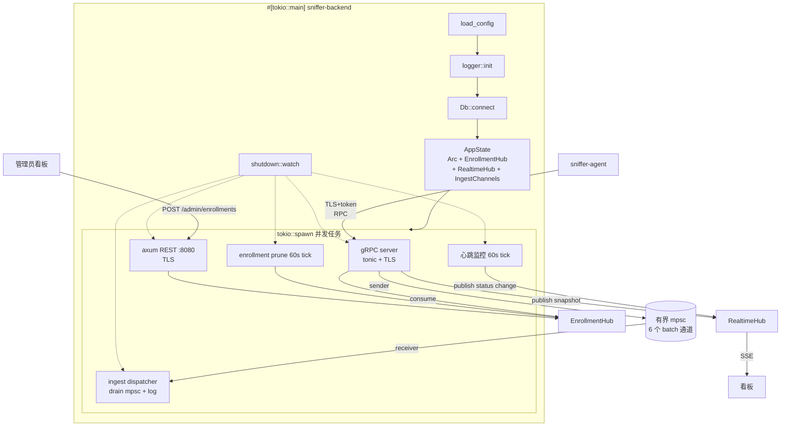
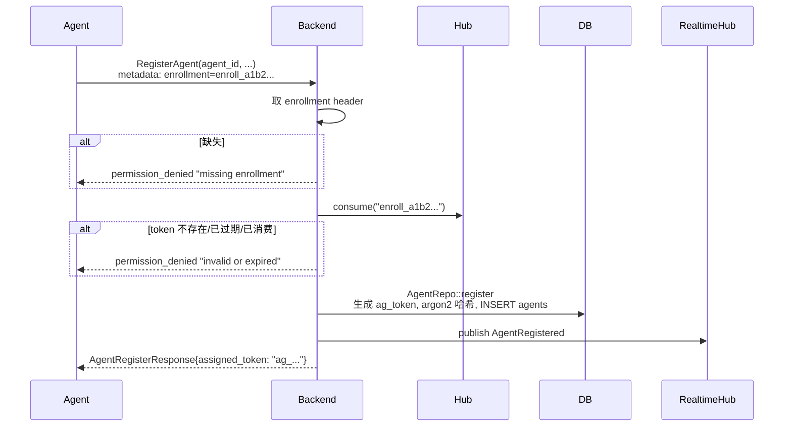

# Slice 4 — 中心服务（backend）骨架

> 上一片：[Slice 3 — gRPC 契约与领域模型](../03-protocol/index.md)

## 1. 目标与范围

把 `sniffer-backend` 从同步 println 占位升级为可运行的中心服务：异步 runtime、配置加载、数据库连接 + migration、gRPC server（含 TLS + token 鉴权）、agent 注册/心跳闭环、ingest 接收骨架、实时状态推送、优雅退出。

**范围内**：

- 依赖补全：tonic / axum / sqlx / argon2 / rustls / dashmap / futures 等。
- `main.rs` 改 `#[tokio::main]`，按"配置 → logger → Db → AppState → spawn(gRPC + REST + 心跳监控 + ingest dispatcher + enrollment prune) → 优雅退出"编排。
- 新 migration：`agents.token_hash`。
- `db::Db::connect` 实装；`AgentRepo`、`MetricsRepo` 注册/心跳相关方法填实（其他 Repo 仍 `todo!()`）。
- gRPC server `AgentLifecycle` 完整实装；`AgentIngest` 六个 `Report*` 做"鉴权 → 转换 → 入 mpsc → 立即回 ReportResponse"骨架（消费者仅 drain & log，真实落库 Slice 9）。
- AuthInterceptor + tracing 过滤 authorization。
- TLS 必开（生产用 PEM 路径配置；开发自签 + `scripts/gen-dev-certs.sh`）。
- `EnrollmentHub`（内存 DashMap）+ 短期一次性引导 token + 后台 prune。
- `RealtimeHub`（内存 agent 快照 + broadcast）+ SSE 推送给看板。
- axum REST：`/api/v1/health` + `/api/v1/admin/enrollments`（CRUD）+ `/api/v1/agents/realtime`（拉）+ `/api/v1/agents/stream`（SSE）。
- 心跳监控 task：周期扫 `agents.last_heartbeat_at`，超时标 `stale`/`offline`，状态变化时 publish 到 RealtimeHub。
- 优雅退出：SIGINT/SIGTERM → 通知所有 server stop accepting → drain mpsc → join。

**范围外**：ingest pipeline 真正写库（Slice 9）；REST 业务路由 torrents/peers/stats（Slice 10）；任务下发业务（Slice 12）；恶意分析（Slice 11）；地域/Meilisearch 同步（Slice 10/13）；agent 端实装（Slice 5）。

## 2. 运行时拓扑



## 3. 文件组织

```text
sniffer-backend/src/
├── main.rs                # #[tokio::main]; 编排; 优雅退出
├── lib.rs                 # pub mod ... (供集成测试用)
├── config.rs              # BackendConfig + load_from_env
├── app.rs                 # AppState 聚合
├── shutdown.rs            # broadcast::Sender<()> + signal::ctrl_c() + unix signals
├── tls.rs                 # PEM 加载 → ServerTlsConfig
├── enrollment/
│   ├── mod.rs             # EnrollmentHub (内存 DashMap)
│   └── prune.rs           # 60s tick: 清理 expired
├── realtime/
│   ├── mod.rs             # RealtimeHub: DashMap<AgentId, AgentSnapshot> + broadcast::Sender
│   └── event.rs           # RealtimeEvent 枚举
├── db/                    # Slice 2 骨架; 本片实装部分方法
│   ├── mod.rs             # Db::connect 实装
│   ├── error.rs
│   ├── pool.rs
│   ├── agent.rs           # register / touch_heartbeat / update_status / lookup_token_hash / mark_stale_and_offline / revoke
│   ├── metrics.rs         # append_history
│   ├── torrent.rs         # 仍 todo!()
│   ├── peer.rs            # 仍 todo!()
│   ├── tracker.rs         # 仍 todo!()
│   ├── dht.rs             # 仍 todo!()
│   ├── malicious.rs       # 仍 todo!()
│   ├── task.rs            # list_pending_for_agent (返回空, FetchTasks 占位)
│   └── failure.rs         # 仍 todo!()
├── grpc/
│   ├── mod.rs             # build_grpc_server(state, shutdown) -> tonic Server
│   ├── auth.rs            # AuthInterceptor: 取 agent-id + Bearer → argon2 verify → Extensions 注入
│   ├── lifecycle.rs       # impl AgentLifecycle for LifecycleService
│   └── ingest.rs          # impl AgentIngest for IngestService (入 mpsc)
├── ingest/
│   ├── mod.rs             # IngestChannels: 6 个 mpsc::Sender
│   └── dispatcher.rs      # spawn 6 个 drain worker, 仅 log
├── rest/
│   ├── mod.rs             # build_router(state) -> axum::Router
│   ├── middleware.rs      # tracing / cors / api_key_guard (admin 路由强制)
│   ├── error.rs           # API 错误 → JSON
│   └── routes/
│       ├── health.rs      # GET /api/v1/health
│       ├── enrollment.rs  # POST/GET/DELETE /api/v1/admin/enrollments
│       └── realtime.rs    # GET /agents/realtime + /agents/stream (SSE)
├── monitor/
│   └── heartbeat.rs       # 60s tick: mark_stale_and_offline + publish realtime
└── cli/
    └── mod.rs             # clap: serve (默认) / agent revoke
```

**lib.rs + main.rs 分**：让集成测试能 `use sniffer_backend::*;` 起内嵌实例。

**CLI**：用 `clap` 提供子命令。`serve` 默认（启动服务）；`agent revoke <agent-id>` 设 `token_hash = NULL` 强制吊销。enrollment 不走 CLI，走管理面板 REST。

## 4. 配置（`config.rs`）

```rust
pub struct BackendConfig {
    pub database_url: String,
    pub grpc_listen: SocketAddr,               // [::]:50051 双栈
    pub rest_listen: SocketAddr,               // [::]:8080
    pub tls: TlsConfig,                        // 必填
    pub admin_api_key: String,                 // admin REST 必填; 无默认值, 缺失则启动失败
    pub heartbeat_stale_after_secs: i64,       // 默认 90
    pub heartbeat_offline_after_secs: i64,     // 默认 600
    pub ingest_channel_capacity: usize,        // 默认 1024
    pub enrollment_default_ttl_secs: i64,      // 默认 300 (5 分钟)
    pub realtime_broadcast_capacity: usize,    // 默认 256
}

pub struct TlsConfig {
    pub cert_path: PathBuf,
    pub key_path: PathBuf,
}
```

`.env.example` 补：

```dotenv
BACKEND_TLS_CERT=./certs/server.crt
BACKEND_TLS_KEY=./certs/server.key
BACKEND_ADMIN_API_KEY=                            # 必填; 用于看板/curl 调 admin REST
BACKEND_HEARTBEAT_STALE_SECS=90
BACKEND_HEARTBEAT_OFFLINE_SECS=600
BACKEND_INGEST_CHANNEL_CAPACITY=1024
BACKEND_ENROLLMENT_DEFAULT_TTL_SECS=300
BACKEND_REALTIME_BROADCAST_CAPACITY=256
```

开发证书生成（`scripts/gen-dev-certs.sh`）：

```bash
openssl req -x509 -newkey ed25519 -days 365 -nodes \
  -keyout certs/server.key -out certs/server.crt \
  -subj "/CN=localhost" \
  -addext "subjectAltName=DNS:localhost,IP:127.0.0.1,IP:::1"
```

`certs/` 入 `.gitignore`；脚本入库。

**TLS 必开**：若 `BACKEND_TLS_CERT` / `BACKEND_TLS_KEY` 缺失或加载失败，**启动失败**，不退化到明文。理由：明文模式存在则开发者图方便长期用，最终生产某次手滑就部署了。直接不留路径。

## 5. 数据库层补丁

### 5.1 migration：`agents.token_hash`

```sql
-- migrations/20260623_000001_agents_token.sql
ALTER TABLE agents ADD COLUMN token_hash text;

COMMENT ON COLUMN agents.token_hash IS 'argon2id 哈希后的 session token; 仅 RegisterAgent 时颁发明文给 agent, 服务端永不存明文; 撤销时置 NULL';

-- 心跳监控 60s tick 用
CREATE INDEX agents_last_heartbeat ON agents (last_heartbeat_at);
```

### 5.2 鉴权方案：argon2 + agent-id metadata 定位

**问题**：argon2 输出含 salt，相同明文每次哈希结果不同，无法 `WHERE token_hash = ?` 反查。

**解法**：agent 每次 RPC 在 metadata 同时携带 `agent-id` + `Bearer <token>`。backend：

1. 取 `agent-id` → `AgentRepo::lookup_token_hash(agent_id)` → `Option<String>`
2. 取 `authorization` → 提 token
3. `argon2::verify_encoded(hash, token)` 通过则 `Request::extensions_mut().insert(AuthedAgent(agent_id))`
4. 否则返 `Status::unauthenticated`

argon2 比对单次 ~10-50ms（默认 OWASP 参数）。按目标负载（每 agent 30s 一次心跳 + 几次 Report 批次），单 backend 实例支撑数千 agent CPU 无压力。

**`agent-id` 不敏感**：必须配合 token 才能用，单独泄露不构成攻击面。

### 5.3 argon2 vs JWT 决策依据

- **argon2 哈希 token**：服务端有状态，每次查 PG argon2 verify；强撤销（一条 UPDATE 立刻失效）；token 是不透明随机串。
- **JWT**：服务端无状态，验签 ~1ms 零 DB IO；难撤销（需短 TTL + refresh 流程或黑名单表）；token 含 payload。

**选 argon2**：agent 是长期跑的进程，需要强撤销；backend 当前单实例，JWT 无状态横向扩容优势用不上；每次 RPC 一次 PK 命中 + argon2 verify 完全可承受。

### 5.4 `AgentRepo` 本片填实方法

```rust
impl AgentRepo {
    /// RegisterAgent: 生成 token、argon2 哈希、UPSERT agent 行
    /// 返回明文 token (仅此一次)
    pub async fn register(&self, req: &AgentRegisterRequest) -> Result<String, DbError> { ... }

    /// 心跳更新
    pub async fn touch_heartbeat(
        &self, agent_id: AgentId, metrics: &serde_json::Value,
    ) -> Result<(), DbError> { ... }

    /// 部分字段 UPDATE
    pub async fn update_status(&self, req: &AgentStatusReport) -> Result<(), DbError> { ... }

    /// interceptor 用
    pub async fn lookup_token_hash(
        &self, agent_id: AgentId,
    ) -> Result<Option<String>, DbError> { ... }

    /// 心跳监控 task 用
    /// 返回 (newly_stale_count, newly_offline_count)
    pub async fn mark_stale_and_offline(
        &self, stale_after_secs: i64, offline_after_secs: i64,
    ) -> Result<(usize, usize), DbError> { ... }

    /// 吊销 (CLI / 看板 admin 调用)
    pub async fn revoke(&self, agent_id: AgentId) -> Result<(), DbError> { ... }
}
```

### 5.5 `MetricsRepo` 本片填实方法

```rust
impl MetricsRepo {
    pub async fn append_history(
        &self, agent_id: AgentId, ts: OffsetDateTime, metrics: serde_json::Value,
    ) -> Result<(), DbError> { ... }
}
```

`agent_metrics_daily` 的 rollup job 推到 Slice 13。

## 6. EnrollmentHub（引导 token）

### 6.1 设计目标

- 让新 agent 第一次能够 `RegisterAgent`：不阻挡合法新 agent，又不让任何人扫到 backend 端口就能注册伪 agent。
- 短期一次性：默认 5 分钟过期，**严格 `max_uses = 1`**（一个 token 对应一个 agent；批量部署就批量生成多个 token）。
- 完全内存：DashMap 存储；backend 重启意味着所有未消费 enrollment 失效（代价小，运维重新生成）。

### 6.2 数据结构

```rust
pub struct EnrollmentHub {
    entries: DashMap<String, EnrollmentEntry>,
}

pub struct EnrollmentEntry {
    pub label: String,
    pub created_at: OffsetDateTime,
    pub expires_at: OffsetDateTime,
    pub consumed: AtomicBool,           // 严格一次性
}

pub struct EnrollmentInfo {
    pub label: String,
}

impl EnrollmentHub {
    /// 生成 token, 返回明文 (仅此一次)
    pub fn create(&self, label: String, ttl: Duration) -> String {
        let token = format!("enroll_{}", random_hex(32));
        self.entries.insert(token.clone(), EnrollmentEntry {
            label,
            created_at: OffsetDateTime::now_utc(),
            expires_at: OffsetDateTime::now_utc() + ttl,
            consumed: AtomicBool::new(false),
        });
        token
    }

    /// 校验 + 消费; 成功后该 token 立即失效
    pub fn consume(&self, token: &str) -> Option<EnrollmentInfo> {
        let entry = self.entries.get(token)?;
        if entry.expires_at < OffsetDateTime::now_utc() { return None; }
        if entry.consumed.swap(true, Ordering::SeqCst) { return None; }   // CAS 防并发
        Some(EnrollmentInfo { label: entry.label.clone() })
    }

    /// 管理员主动撤销 (未消费的)
    pub fn revoke(&self, token_prefix: &str) -> bool {
        let key = self.entries.iter()
            .find(|kv| kv.key().starts_with(token_prefix))
            .map(|kv| kv.key().clone());
        match key {
            Some(k) => self.entries.remove(&k).is_some(),
            None => false,
        }
    }

    /// 60s tick 清理已过期或已消费的
    pub fn prune(&self) {
        let now = OffsetDateTime::now_utc();
        self.entries.retain(|_, e|
            e.expires_at > now && !e.consumed.load(Ordering::Relaxed)
        );
    }

    /// 列表 (返回 token 前缀, 不返回全文)
    pub fn list(&self) -> Vec<EnrollmentSummary> { ... }
}
```

### 6.3 admin REST endpoints

强制 `BACKEND_ADMIN_API_KEY` 鉴权（中间件检查 `X-API-Key` header）：

```text
POST   /api/v1/admin/enrollments
       Body: {"label": "agent-tokyo-1", "ttl_secs": 300}    // ttl_secs 可省, 用默认
       Resp: {"token": "enroll_a1b2c3...", "expires_at": "..."}

GET    /api/v1/admin/enrollments
       Resp: [{"token_prefix": "enroll_a1b2", "label": "...",
               "created_at": "...", "expires_at": "..."}]

DELETE /api/v1/admin/enrollments/{token_prefix}
       (token_prefix: 前 16 字符即可定位)
       Resp: 204 No Content / 404 Not Found
```

明文 token **仅在 POST 响应中出现一次**；之后所有 GET/DELETE 都只用前缀。

### 6.4 `RegisterAgent` handler 引导分支



handler 伪代码：

```rust
async fn register_agent(
    &self, req: Request<pb::AgentRegisterRequest>,
) -> Result<Response<pb::AgentRegisterResponse>, Status> {
    let enrollment = req.metadata().get("enrollment")
        .and_then(|v| v.to_str().ok())
        .ok_or_else(|| Status::permission_denied("missing enrollment header"))?;

    let info = self.state.enrollment_hub.consume(enrollment)
        .ok_or_else(|| Status::permission_denied("invalid or expired enrollment"))?;

    let inner = req.into_inner();
    let plain_token = self.state.db.agent.register(&inner).await
        .map_err(|e| Status::internal(e.to_string()))?;

    tracing::info!(
        agent_id = %inner.agent_id, label = %info.label,
        "agent registered via enrollment",
    );

    self.state.realtime.publish_registered(/* AgentSnapshot from inner */);

    Ok(Response::new(pb::AgentRegisterResponse {
        assigned_token: plain_token,
        server_time_unix_ms: now_ms(),
        heartbeat_interval_secs: 30,
    }))
}
```

## 7. RealtimeHub（实时状态推送）

### 7.1 设计目标

- 看板"打开就实时看到所有 agent 状态"，无 30 秒延迟。
- backend 内存维护一份 agent 快照，每次 Heartbeat / ReportAgentStatus / 状态变化都同步更新 + 广播给订阅者。
- 看板订阅走 SSE（Server-Sent Events），不上 WebSocket（单向推送够用，HTTP 兼容性好）。

### 7.2 数据结构

```rust
pub struct RealtimeHub {
    snapshots: DashMap<AgentId, AgentSnapshot>,
    tx: broadcast::Sender<RealtimeEvent>,
}

pub struct AgentSnapshot {
    pub agent_id: AgentId,
    pub hostname: String,
    pub status: AgentStatus,                // online / stale / offline
    pub last_heartbeat_at: OffsetDateTime,
    pub uptime_secs: i64,
    pub metrics: serde_json::Value,         // jsonb 快照, 与 PG 一致
    pub public_ip_v4: Option<IpAddr>,
    pub public_ip_v6: Option<IpAddr>,
    pub version: String,
    pub region: String,
    pub capabilities: Vec<String>,
    pub updated_at: OffsetDateTime,
}

pub enum RealtimeEvent {
    AgentRegistered(AgentSnapshot),
    AgentUpdated(AgentSnapshot),
    AgentBecameStale(AgentId),
    AgentBecameOffline(AgentId),
}

impl RealtimeHub {
    pub fn publish_heartbeat(&self, snapshot: AgentSnapshot);
    pub fn publish_status_change(&self, agent_id: AgentId, new_status: AgentStatus);
    pub fn publish_registered(&self, snapshot: AgentSnapshot);
    pub fn current(&self) -> Vec<AgentSnapshot>;
    pub fn subscribe(&self) -> broadcast::Receiver<RealtimeEvent>;
}
```

### 7.3 看板 REST endpoints

```text
GET /api/v1/agents/realtime
    Resp: [{...AgentSnapshot...}, ...]                 // 全量当前快照, 用于首屏

GET /api/v1/agents/stream
    Content-Type: text/event-stream
    持续推送:
    data: {"event":"updated","payload":{...}}\n\n
    data: {"event":"offline","payload":{"agent_id":"..."}}\n\n
```

这两个端点也走 API key（与 admin 共用），但**不属于 admin**（看板查看 ≠ 看板管理）—— 实施时可以拆两个 key。当前共用即可。

### 7.4 广播容量与降级

- `broadcast::Sender` 默认 capacity = 256（可配）。
- 慢订阅者（看板卡了 / 网络抖动）会收到 `RecvError::Lagged`：服务端不阻塞，看板自行重连即可（SSE 重连机制天然支持）。
- 重连后看板调一次 `/agents/realtime` 拿全量，再开新流。

## 8. gRPC 服务实装

### 8.1 `AuthInterceptor`

```rust
pub struct AuthInterceptor {
    state: Arc<AppState>,
}

impl Interceptor for AuthInterceptor {
    fn call(&mut self, mut req: Request<()>) -> Result<Request<()>, Status> {
        // RegisterAgent 豁免: handler 自行处理 enrollment
        if is_register_agent_path(&req) {
            return Ok(req);
        }

        let agent_id = req.metadata().get("agent-id")
            .and_then(|v| v.to_str().ok())
            .and_then(|s| Uuid::parse_str(s).ok())
            .map(AgentId)
            .ok_or_else(|| Status::unauthenticated("missing agent-id"))?;

        let token = req.metadata().get("authorization")
            .and_then(|v| v.to_str().ok())
            .and_then(|s| s.strip_prefix("Bearer "))
            .ok_or_else(|| Status::unauthenticated("missing bearer token"))?;

        // 注意: Interceptor 是同步 trait, 需要在 sync 上下文调 async
        // 实际实现用 tokio::task::block_in_place + Handle::current 或换 tonic 的 service layer 模式
        let hash = futures::executor::block_on(
            self.state.db.agent.lookup_token_hash(agent_id),
        ).map_err(|_| Status::internal("db error"))?
         .ok_or_else(|| Status::unauthenticated("token revoked"))?;

        argon2::verify_encoded(&hash, token.as_bytes())
            .map_err(|_| Status::unauthenticated("invalid token"))?;

        req.extensions_mut().insert(AuthedAgent(agent_id));
        Ok(req)
    }
}
```

> 上面 `block_on` 是简化示意；实际实施用 tonic `service_fn` + `tower::Layer` 做异步 middleware，避免阻塞 runtime。

### 8.2 `AgentLifecycle` 心跳/状态/任务

```rust
async fn heartbeat(
    &self, req: Request<pb::HeartbeatRequest>,
) -> Result<Response<pb::HeartbeatResponse>, Status> {
    let agent_id = req.extensions().get::<AuthedAgent>()
        .ok_or_else(|| Status::unauthenticated("missing auth"))?.0;
    let inner = req.into_inner();

    let metrics_json = serde_json::to_value(&inner.metrics)
        .map_err(|e| Status::internal(e.to_string()))?;

    self.state.db.agent.touch_heartbeat(agent_id, &metrics_json).await
        .map_err(|e| Status::internal(e.to_string()))?;
    self.state.db.metrics.append_history(
        agent_id, OffsetDateTime::now_utc(), metrics_json.clone(),
    ).await.map_err(|e| Status::internal(e.to_string()))?;

    self.state.realtime.publish_heartbeat(/* AgentSnapshot from inner */);

    Ok(Response::new(pb::HeartbeatResponse {
        server_time_unix_ms: now_ms(),
        next_interval_secs: 30,
    }))
}

async fn fetch_tasks(
    &self, _req: Request<pb::FetchTasksRequest>,
) -> Result<Response<Self::FetchTasksStream>, Status> {
    // Slice 12 接业务; 当前长轮询无限期挂起直到 shutdown
    let (tx, rx) = mpsc::channel(1);
    // 不发任何消息, agent 端会持续 hold 流; shutdown 时 drop tx
    Ok(Response::new(Box::pin(ReceiverStream::new(rx))))
}
```

### 8.3 `AgentIngest` 骨架

每个 `Report*` 同模板：

```rust
async fn report_torrents(
    &self, req: Request<pb::TorrentBatch>,
) -> Result<Response<pb::ReportResponse>, Status> {
    let agent_id = req.extensions().get::<AuthedAgent>()
        .ok_or_else(|| Status::unauthenticated("missing auth"))?.0;
    let batch = req.into_inner();

    let mut accepted = 0;
    let mut rejected = Vec::new();
    let mut models = Vec::with_capacity(batch.records.len());

    for (idx, pb_rec) in batch.records.into_iter().enumerate() {
        match model::TorrentRecord::try_from(pb_rec) {
            Ok(m) => { models.push(m); accepted += 1; }
            Err(e) => rejected.push(pb::RejectedItem {
                index: idx as i32, reason: e.to_string(),
            }),
        }
    }

    // 入有界 mpsc; 满则 Status::unavailable 让 agent 重试 (背压)
    match self.channels.torrents
        .send_timeout(IngestBatch { agent_id, items: models }, Duration::from_millis(100))
        .await
    {
        Ok(_) => {}
        Err(_) => return Err(Status::unavailable("ingest queue full")),
    }

    let seq = self.next_seq();
    Ok(Response::new(pb::ReportResponse {
        accepted, rejected: rejected.len() as i32,
        rejected_reason: if rejected.is_empty() { String::new() }
                         else { "validation failed".into() },
        detail: rejected, server_seq: seq,
    }))
}
```

六种 batch 同模式（torrents / metadata / peers / dht_observations / malicious / fetch_failures），各占自己的 mpsc。

## 9. ingest dispatcher 骨架

```rust
pub struct IngestChannels {
    pub torrents:         mpsc::Sender<IngestBatch<model::TorrentRecord>>,
    pub metadata:         mpsc::Sender<IngestBatch<model::MetadataRecord>>,
    pub peers:            mpsc::Sender<IngestBatch<model::PeerRecord>>,
    pub dht_observations: mpsc::Sender<IngestBatch<model::DhtObservation>>,
    pub malicious:        mpsc::Sender<IngestBatch<model::MaliciousFlag>>,
    pub fetch_failures:   mpsc::Sender<IngestBatch<model::FetchFailureRecord>>,
}

pub struct IngestBatch<T> {
    pub agent_id: AgentId,
    pub items: Vec<T>,
}

pub fn spawn(receivers: IngestReceivers, shutdown: ShutdownToken) -> JoinHandle<()> {
    tokio::spawn(async move {
        let workers = vec![
            spawn_drainer("torrents",         receivers.torrents,         shutdown.clone()),
            spawn_drainer("metadata",         receivers.metadata,         shutdown.clone()),
            spawn_drainer("peers",            receivers.peers,            shutdown.clone()),
            spawn_drainer("dht_observations", receivers.dht_observations, shutdown.clone()),
            spawn_drainer("malicious",        receivers.malicious,        shutdown.clone()),
            spawn_drainer("fetch_failures",   receivers.fetch_failures,   shutdown.clone()),
        ];
        futures::future::join_all(workers).await;
    })
}

async fn spawn_drainer<T>(
    kind: &'static str,
    mut rx: mpsc::Receiver<IngestBatch<T>>,
    mut shutdown: broadcast::Receiver<()>,
) {
    loop {
        tokio::select! {
            biased;
            _ = shutdown.recv() => {
                // 关闭前 drain 已接收的
                while let Ok(batch) = rx.try_recv() {
                    tracing::info!(kind, count = batch.items.len(), "drained on shutdown");
                }
                break;
            }
            Some(batch) = rx.recv() => {
                tracing::info!(kind, agent = %batch.agent_id, count = batch.items.len(), "ingest");
                // Slice 9 在这里调 Db 写入
            }
            else => break,
        }
    }
}
```

**为什么 Slice 4 不写库**：ingest 涉及 UPSERT 策略、批合并、事务边界设计，足够 Slice 9 独立讨论。本片只验证管道接通 + 背压路径。

## 10. axum REST 骨架

```rust
pub fn build_router(state: Arc<AppState>) -> Router {
    // 公开路由 (无鉴权)
    let public = Router::new()
        .route("/api/v1/health", get(routes::health::handler));

    // admin 路由 (强制 X-API-Key)
    let admin = Router::new()
        .route("/api/v1/admin/enrollments",
            post(routes::enrollment::create).get(routes::enrollment::list))
        .route("/api/v1/admin/enrollments/:token_prefix",
            delete(routes::enrollment::revoke))
        .layer(middleware::from_fn_with_state(state.clone(), middleware::api_key_guard));

    // 看板路由 (强制 X-API-Key, 当前与 admin 共用)
    let dashboard = Router::new()
        .route("/api/v1/agents/realtime", get(routes::realtime::current))
        .route("/api/v1/agents/stream", get(routes::realtime::stream))
        .layer(middleware::from_fn_with_state(state.clone(), middleware::api_key_guard));

    public.merge(admin).merge(dashboard)
        .layer(TraceLayer::new_for_http())
        .layer(CorsLayer::permissive())   // dev; 生产收紧
        .with_state(state)
}
```

`/health` 响应：

```json
{
  "status": "ok",
  "version": "0.1.0",
  "db": "ok",
  "uptime_secs": 1234
}
```

`db: ok|error` 通过一次 `SELECT 1` ping 决定；DB 不通整体 HTTP 500。

## 11. 优雅退出

```mermaid
flowchart TD
    A[SIGINT/SIGTERM] --> B[shutdown::broadcast 发送]
    B --> C[gRPC server 停止接受新连接]
    B --> D[axum hyper graceful_shutdown]
    B --> E[心跳监控 break loop]
    B --> F[enrollment prune break loop]
    B --> G[ingest receivers 收到 None (sender drop)]
    C --> H[等待 in-flight RPC 完成, 最长 10s]
    D --> I[等待 in-flight HTTP 完成]
    G --> J[drain 剩余 batch + log<br/>Slice 9 起改为落库]
    H --> K[main 退出]
    I --> K
    J --> K
    E --> K
    F --> K
```

- `tokio::sync::broadcast::Sender<()>` 在 main 持有；各 spawn 任务在 `tokio::select!` 里同时 `await` 自己的工作 + `shutdown.recv()`。
- gRPC 用 `tonic::transport::Server::serve_with_shutdown(addr, shutdown_signal())`。
- axum 用 `axum::serve(listener, app).with_graceful_shutdown(shutdown_signal()).await`。
- ingest dispatcher 收到 shutdown 后先把 mpsc 里剩余 batch drain 干净。
- 全局退出超时 30 秒，超时则 abort。

## 12. 关键技术取舍

### 12.1 enrollment 严格一次性

`max_uses = 1` 硬编码，不可配。批量部署就批量调 POST 生成多个独立 token。理由：

- 数据结构最简（无原子计数器并发逻辑）。
- 流程语义清晰（一个 token 一个 agent，审计一对一）。
- 即使运维写错 label 也不影响（token 自身唯一）。
- 批量 10 个 agent 就调 10 次 POST，看板 UI 实现成本极低。

### 12.2 enrollment 完全内存，不入 DB

理由：

- 短期凭证（5 分钟级），DB 价值低。
- 内存 DashMap O(1) 查找，无 argon2 全表 verify。
- backend 重启意味着所有未消费失效 —— 代价小，运维重新生成即可（enrollment 本就是临时操作）。

未来若 backend 多实例部署：要么 sticky session（运维生成 enrollment 后只走同一实例注册），要么把 enrollment 改入 Redis 共享。proto / 业务流程都不变。

### 12.3 RealtimeHub 内存独立，不依赖 PG 状态

PG 是历史事实；RealtimeHub 是当前快照。两者职责分离：

- 看板首屏 / 实时推送走 RealtimeHub（毫秒级，零 DB）。
- 历史趋势 / 跨重启回溯走 PG `agent_metrics_history`。

backend 重启：RealtimeHub 清空，agent 下次心跳即填回；不影响数据完整性。

### 12.4 SSE 而非 WebSocket

- 单向推送（backend → 看板）够用。
- 标准 HTTP，与 axum 路由、TLS、反向代理完全兼容，无升级握手坑。
- 浏览器原生 `EventSource` API，前端零依赖。
- WebSocket 是双向通信，杀鸡用牛刀。

### 12.5 TLS 必开，无明文 fallback

启动时若 TLS 配置缺失或加载失败直接启动失败。理由：明文模式存在则开发者图方便长期用，最终生产某次手滑就部署了。开发者用自签证书脚本，零摩擦。

### 12.6 心跳监控 60s 全表扫而非事件驱动

全表 `WHERE last_heartbeat_at < now() - X` 走 `agents_last_heartbeat` 索引，在 agent 数 < 10000 时完全无压力。事件驱动需要单调时间序，复杂度高。

### 12.7 lib.rs + main.rs 双形态

让 `tests/integration_test.rs` 能 `use sniffer_backend::*;` 在测试里启完整闭环。Slice 4 本身不写完整集成测试（单元测试覆盖关键模块），但留好结构供 Slice 5 联调用。

## 13. 验收标准

- `docker compose up -d postgres meilisearch` 起服务；`scripts/gen-dev-certs.sh` 跑过有 `certs/server.{crt,key}`；`.env` 已填 `BACKEND_ADMIN_API_KEY`。
- `cargo run -p sniffer-backend serve` 启动后日志：
  - `database connected, migrations up to date`
  - `gRPC server listening on [::]:50051 (TLS)`
  - `REST server listening on [::]:8080 (TLS)`
  - `heartbeat monitor started, tick=60s`
  - `enrollment hub started, prune tick=60s`
  - `ingest dispatcher started with 6 channels (capacity=1024)`
  - `realtime hub started, broadcast capacity=256`
- `curl -k https://localhost:8080/api/v1/health` 返回 200，body 含 `"db":"ok"`。
- 调 admin REST 生成 enrollment：

  ```bash
  curl -k -X POST https://localhost:8080/api/v1/admin/enrollments \
    -H "X-API-Key: <key>" -H "Content-Type: application/json" \
    -d '{"label":"test-1","ttl_secs":300}'
  ```

  返回 `{"token":"enroll_...", "expires_at":"..."}`。
- 用该 enrollment + 一个 grpcurl 模拟 `RegisterAgent`：

  ```bash
  grpcurl -insecure -H "enrollment: enroll_..." \
    -d '{"agent_id":"7f3c...", ...}' \
    localhost:50051 sniffer.v1.AgentLifecycle/RegisterAgent
  ```

  返回 `{"assigned_token":"ag_...", ...}`；`psql -c "SELECT agent_id, token_hash IS NOT NULL FROM agents"` 见新行。
- 同 enrollment 再调一次 → `permission_denied "invalid or expired enrollment"`。
- 用 (agent_id, ag_token) 调 `Heartbeat`：`psql` 见 `last_heartbeat_at` 更新、`agent_metrics_history` 新增一行。
- 不带 token 调 `Heartbeat` → `Status::unauthenticated`。
- `curl -k -H "X-API-Key: <key>" https://localhost:8080/api/v1/agents/realtime` 返回包含刚注册 agent 的快照数组。
- `curl -k -N -H "X-API-Key: <key>" https://localhost:8080/api/v1/agents/stream` 保持连接；触发一次 Heartbeat 后立刻看到 `data: {"event":"updated",...}`。
- 调任意 `Report*` 上送合法批次 → `ReportResponse{accepted=N}`；日志见 `ingest kind=torrents count=N`。
- 上送 `infohash_hex` 非法的 record → `ReportResponse.detail` 含 `reason="invalid infohash hex..."`。
- `cargo run -p sniffer-backend agent revoke <agent-id>` → `psql` 见 `token_hash IS NULL`；该 agent 下次 RPC 收 `unauthenticated`。
- 关 backend（Ctrl+C）：日志见 `shutdown signal received` → `gRPC stopped` → `REST stopped` → `ingest drained N items` → `exit 0`，30 秒内退完。
- 手动 `UPDATE agents SET last_heartbeat_at = now() - interval '120 seconds'` 等 60 秒 → `status='stale'` + RealtimeHub publish `AgentBecameStale`；再 `now() - interval '700 seconds'` → `offline`。
- `cargo clippy -p sniffer-backend -- -D warnings` 全绿。
- `cargo build --workspace` 在 `SQLX_OFFLINE=true` 下成功（migration 更新后 `.sqlx/` 已 prepare 并提交）。

## 14. 后续延伸

- ingest dispatcher 真正落库 → Slice 9。
- REST 业务路由（torrents / peers / stats）+ Meilisearch 查询接入 → Slice 10。
- `FetchTasks` 真接业务（任务表轮询、流式推送）→ Slice 12。
- 恶意事件入库及聚合查询 → Slice 11。
- `agent_metrics_daily` rollup + 分区维护脚本 → Slice 13。
- mTLS 加固 → Slice 13 可选。
- enrollment 跨实例共享（如需 backend 多实例）→ 未来专项。
