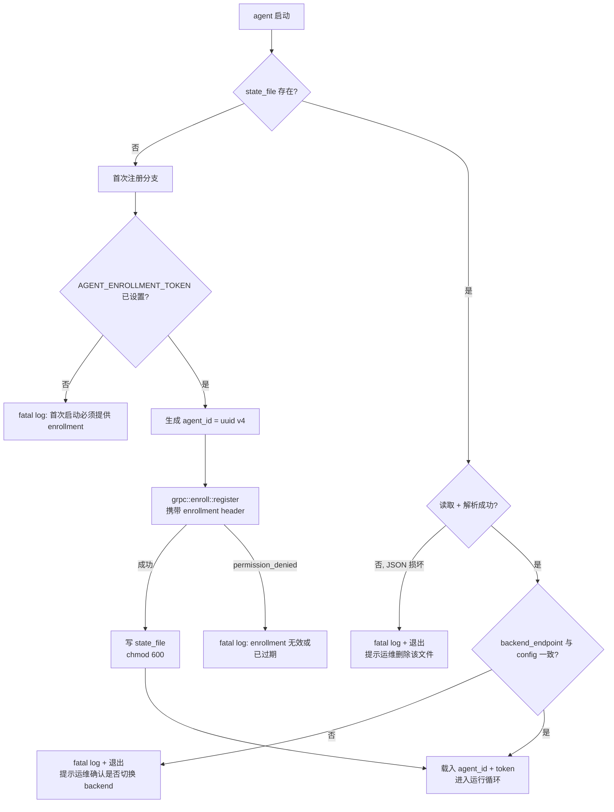
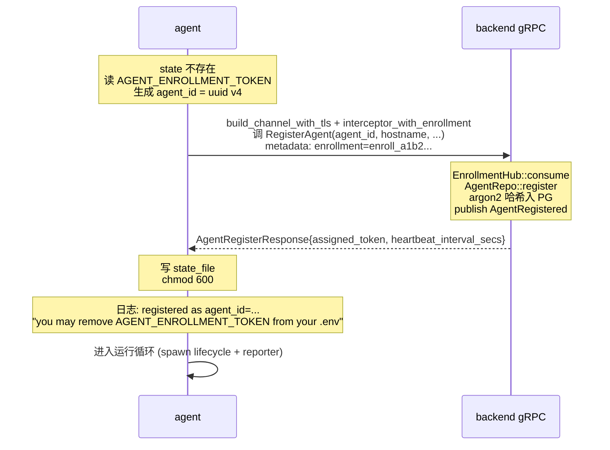
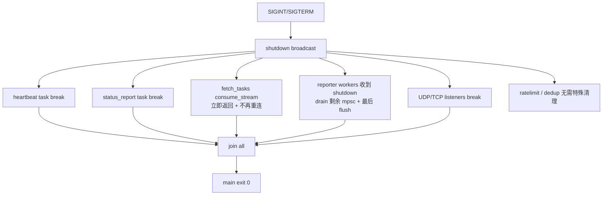

# Slice 5 — agent 骨架与生命周期

> 上一片：[Slice 4 — 中心服务（backend）骨架](../04-backend-skeleton/index.md)

## 1. 目标与范围

把 `sniffer-agent` 从只输出"Starting Sniffer Agent..."的占位升级到**可与 backend 完整闭环对话**的中心 agent 进程：配置加载、首次注册引导、gRPC 双向通信、心跳/状态上报、批次上报骨架、双栈端口监听占位、优雅退出。**业务深度仅到"能跑通 lifecycle + 把空 batch 也能投出"**，BT 协议（bencode/DHT/BEP-9）从 Slice 6 起接入。

**范围内**：

- 依赖补全：tonic / time / serde_json / rand / clap / dashmap / 等。
- `main.rs` 改为 `clap` 驱动的 `#[tokio::main]`，子命令 `serve` 默认。
- `config.rs` 全量配置加载（含 backend endpoint / TLS CA / enrollment / state 文件路径 / 心跳间隔 / 限速参数等）。
- **state 文件管理**：`agent-state.json` 持久化 `(agent_id, assigned_token)`；权限 600；缺失/损坏时走首次注册。
- **首次注册引导**：检查 state → 不存在则读 `AGENT_ENROLLMENT_TOKEN` → 自生 `agent_id` (uuid v4) → 调 `RegisterAgent`（metadata 带 `enrollment`）→ 写 state；token 持久化后清空内存里的 enrollment。
- **gRPC client**：tonic Channel + TLS（信任 backend 服务器证书）+ AuthInterceptor（自动注入 `agent-id` + `Bearer`）。
- **lifecycle tasks**：30s 心跳、5min 状态上报（或公网 IP 变化触发）、`FetchTasks` 流长轮询 + 断线指数退避重连。
- **reporter 骨架**：6 个 `mpsc::Receiver`（torrents / metadata / peers / dht_observations / malicious / fetch_failures），各自带 flush-on-size-or-interval 缓冲 → 调对应 `Report*` RPC；指数退避重试；服务端 `unavailable` 时背压。
- **限速器、去重缓存**：接口/字段先就位（`DashMap` + 令牌桶），但 Slice 5 不接 BT 流量，仅有空闲组件。
- **双栈 UDP/TCP listener**：按 config 绑定端口（v4 + v6），仅日志 + 不收发任何 BT 数据；Slice 6+ 接入实际协议。
- **`unauthenticated` 处理**：删 state 文件 → fatal log → 非零退出，等运维介入。
- **优雅退出**：SIGINT/SIGTERM → 停止 lifecycle tasks → 关闭 mpsc → drain reporter buffers → join。

**范围外**：DHT 实质爬取（Slice 7）、BEP-9 元数据抓取（Slice 8）、reporter 真正发出非空批次（Slice 6 起 BT 引擎产出后才有内容）、限速器调参与具体策略（Slice 7）、agent 端恶意检测规则（Slice 11）。

## 2. 运行时拓扑

```mermaid
flowchart TB
    subgraph Main["#[tokio::main] sniffer-agent"]
        Cfg[load_config]
        Log[logger::init]
        State[state::load_or_init<br/>读 agent-state.json<br/>或走首次注册]
        Cli[grpc::build_clients<br/>tonic Channel + TLS<br/>+ AuthInterceptor]
        Rt[AgentRuntime<br/>Arc&lt;MetricsState&gt;<br/>+ Reporter + Dedup<br/>+ Ratelimiter]
        Shut[shutdown::watch]

        Cfg --> Log --> State --> Cli --> Rt --> Spawn

        subgraph Spawn["tokio::spawn 并发任务"]
            HB[heartbeat 30s tick]
            ST[status_report 5min / IP 变化]
            FT[fetch_tasks 流消费 + 重连]
            R1[reporter worker × 6<br/>(buffer + flush)]
            UD[UDP listener × 2<br/>(v4 + v6, 占位)]
            TC[TCP listener × 2<br/>(v4 + v6, 占位)]
        end

        Shut -.-> HB & ST & FT & R1 & UD & TC
    end

    HB -->|RPC| BE[backend gRPC]
    ST -->|RPC| BE
    FT -->|stream| BE
    R1 -->|RPC batch| BE

    BE -.unauthenticated.-> Err[state::delete<br/>fatal exit]
```

## 3. 文件组织

```text
sniffer-agent/src/
├── main.rs                # clap 子命令 + #[tokio::main]; 编排; 优雅退出
├── lib.rs                 # pub mod ... (供集成测试用)
├── config.rs              # AgentConfig + load_from_env
├── app.rs                 # AgentRuntime 聚合
├── shutdown.rs            # broadcast::Sender<()> + signal::ctrl_c + unix signals
├── tls.rs                 # 从配置路径加载 backend CA 证书
├── cli/
│   └── mod.rs             # clap: serve (默认) / show-id / regenerate-state
├── state/
│   └── mod.rs             # AgentStateFile 读写; chmod 600; 损坏检测
├── grpc/
│   ├── mod.rs             # build_lifecycle_client / build_ingest_client
│   ├── auth.rs            # AuthInterceptor: 注入 agent-id + Bearer
│   └── enroll.rs          # RegisterAgent 一次性流程 (单独建 channel, 带 enrollment header)
├── lifecycle/
│   ├── mod.rs             # spawn_all(rt, shutdown)
│   ├── register.rs        # 首次注册逻辑
│   ├── heartbeat.rs       # 30s tick
│   ├── status.rs          # 5min tick + 公网 IP 变化触发
│   └── tasks.rs           # FetchTasks 流消费 + 指数退避重连
├── metrics/
│   ├── mod.rs             # MetricsState: 计数器 (AtomicI64) + cache_size 读
│   └── snapshot.rs        # 心跳时聚合成 AgentMetricsSnapshot
├── reporter/
│   ├── mod.rs             # ReporterChannels: 6 个 mpsc::Sender + spawn workers
│   ├── buffer.rs          # 每 kind 的批缓冲 (size 上限 + 时间上限)
│   └── worker.rs          # 6 个 worker: 消费 mpsc -> buffer -> flush -> Report* RPC
├── ratelimit/
│   └── mod.rs             # 全局 + per-peer 令牌桶 (接口; Slice 7 实质使用)
├── dedup/
│   └── mod.rs             # DashMap<Infohash, OffsetDateTime> 有界 + LRU/TTL (接口)
├── net/
│   ├── mod.rs             # spawn_listeners(cfg, shutdown)
│   ├── udp.rs             # 双栈 UDP 端口绑定 + recv loop 占位 (Slice 7 接 DHT)
│   └── tcp.rs             # 双栈 TCP 端口绑定 + accept loop 占位 (Slice 8 接 peer wire)
└── public_ip/
    └── mod.rs             # (可选) 公网 IP 自检测 (STUN / 第三方 echo); 默认关闭
```

## 4. 配置（`config.rs`）

```rust
pub struct AgentConfig {
    pub backend_endpoint: String,            // https://backend:50051
    pub backend_ca_path: Option<PathBuf>,    // 自签 CA 路径; None = 系统根证书
    pub state_file: PathBuf,                 // 默认 ./agent-state.json
    pub enrollment_token: Option<String>,    // 仅首次部署填; 注册后清空
    pub dht_listen_v4: Option<SocketAddrV4>, // 0.0.0.0:6881 默认; None = 不监听 v4
    pub dht_listen_v6: Option<SocketAddrV6>, // [::]:6881 默认; None = 不监听 v6
    pub peer_listen_v4: Option<SocketAddrV4>,// TCP, 同上
    pub peer_listen_v6: Option<SocketAddrV6>,
    pub public_ip_v4: Option<IpAddr>,        // 自报告; 留空表示 NAT 后
    pub public_ip_v6: Option<IpAddr>,
    pub public_ip_detect: bool,              // 启用自检测? 默认 false
    pub announce_peer: bool,                 // BEP-5 announce_peer 是否启用; 默认 false (NAT 后污染保护)
    pub region: String,                      // 自报告 region 标签
    pub heartbeat_interval_secs: u64,        // 默认 30; 可被 backend RegisterAgent 响应覆盖
    pub status_report_interval_secs: u64,    // 默认 300
    pub fetch_tasks_max_concurrent: u32,     // 默认 0 (服务端默认)
    pub fetch_tasks_reconnect_backoff_initial_secs: u64,  // 默认 1
    pub fetch_tasks_reconnect_backoff_max_secs: u64,      // 默认 60
    pub reporter: ReporterConfig,
    pub ratelimit: RatelimitConfig,
    pub dedup: DedupConfig,
}

pub struct ReporterConfig {
    pub channel_capacity: usize,             // 每个 mpsc 容量, 默认 1024
    pub flush_interval_ms: u64,              // 默认 1000
    pub batch_size_torrents: usize,          // 默认 500
    pub batch_size_metadata: usize,          // 默认 100
    pub batch_size_peers: usize,             // 默认 1000
    pub batch_size_dht_observations: usize,  // 默认 2000
    pub batch_size_malicious: usize,         // 默认 200
    pub batch_size_fetch_failures: usize,    // 默认 1000
    pub rpc_retry_max_attempts: u32,         // 默认 5
    pub rpc_retry_initial_backoff_ms: u64,   // 默认 200
    pub rpc_retry_max_backoff_ms: u64,       // 默认 10000
}

pub struct RatelimitConfig {
    pub global_dht_qps: u32,                 // 默认 200
    pub per_peer_min_interval_ms: u64,       // 默认 5000
    pub max_outstanding_dht_queries: u32,    // 默认 100
}

pub struct DedupConfig {
    pub capacity: usize,                     // 默认 5_000_000 (infohash 条目)
    pub ttl_secs: u64,                       // 默认 86400 (24h)
}
```

`.env.example` 补：

```dotenv
AGENT_BACKEND_ENDPOINT=https://localhost:50051
AGENT_BACKEND_CA=./certs/server.crt           # 开发自签时配; 生产留空走系统根
AGENT_STATE_FILE=./agent-state.json
AGENT_ENROLLMENT_TOKEN=                       # 仅首次部署填; 注册成功后注释掉

AGENT_DHT_LISTEN_V4=0.0.0.0:6881
AGENT_DHT_LISTEN_V6=[::]:6881
AGENT_PEER_LISTEN_V4=0.0.0.0:6881
AGENT_PEER_LISTEN_V6=[::]:6881

AGENT_PUBLIC_IP_V4=                           # NAT 后留空; announce_peer 也将默认关闭
AGENT_PUBLIC_IP_V6=
AGENT_PUBLIC_IP_DETECT=false
AGENT_ANNOUNCE_PEER=false

AGENT_REGION=
AGENT_HEARTBEAT_INTERVAL_SECS=30
AGENT_STATUS_REPORT_INTERVAL_SECS=300

AGENT_REPORTER_CHANNEL_CAPACITY=1024
AGENT_REPORTER_FLUSH_INTERVAL_MS=1000
```

## 5. state 文件管理

### 5.1 文件格式

`agent-state.json`：

```json
{
  "agent_id": "7f3c1234-aaaa-bbbb-cccc-ddddeeee0000",
  "token": "ag_a1b2c3d4...",
  "created_at": "2026-06-21T15:30:00Z",
  "backend_endpoint": "https://localhost:50051"
}
```

`backend_endpoint` 写入是为了校验：如果 `.env` 改了 backend 地址，agent 启动时要么报错（防止误连错的 backend），要么走重新注册。**采用前者**：地址不一致时 fatal log + 退出，由运维主动删 state 才走重新注册路径。

### 5.2 读写流程



### 5.3 权限与原子写

- 写入采用 "写临时文件 → fsync → rename"，避免崩溃导致半文件。
- 写入后 `chmod 600`（Unix）；Windows 不强制（ACL 模型不同，靠 NTFS 用户权限）。
- 读取时若发现权限非 600 → 警告日志，继续运行（开发环境可能放宽）；**生产不强制**，留给运维与部署脚本约束。

## 6. 首次注册流程

### 6.1 时序



### 6.2 与"运行期 channel"的区别

注册阶段的 gRPC channel **不能用** AuthInterceptor（因为还没 token）。两种实现方式：

- **方式 A（推荐）**：注册用一个一次性 channel，注入 enrollment header 的 simple interceptor；注册成功后 drop，立即用 token 重建运行期 channel。
- **方式 B**：单 channel + 动态 interceptor 状态机（注册前注 enrollment，注册后切 Bearer）。

选 A：代码简洁、生命周期清晰，注册 channel 只活几秒。

```rust
// grpc/enroll.rs
pub async fn register_once(
    cfg: &AgentConfig, enrollment: &str, agent_id: AgentId, hostname: &str,
) -> Result<RegisterResult, EnrollError> {
    let channel = build_tls_channel(cfg).await?;
    let token = enrollment.to_owned();
    let client = AgentLifecycleClient::with_interceptor(channel, move |mut req: Request<()>| {
        req.metadata_mut().insert("enrollment", token.parse().unwrap());
        Ok(req)
    });
    let resp = client.register_agent(AgentRegisterRequest { /* ... */ }).await?;
    Ok(RegisterResult {
        assigned_token: resp.into_inner().assigned_token,
        heartbeat_interval_secs: resp.into_inner().heartbeat_interval_secs,
    })
}
```

## 7. gRPC client 与 AuthInterceptor

```rust
// grpc/auth.rs
#[derive(Clone)]
pub struct AuthInterceptor {
    agent_id: String,                        // uuid 文本
    bearer: String,                          // "Bearer ag_..."
}

impl Interceptor for AuthInterceptor {
    fn call(&mut self, mut req: Request<()>) -> Result<Request<()>, Status> {
        req.metadata_mut().insert("agent-id",
            self.agent_id.parse().map_err(|_| Status::internal("bad agent-id"))?);
        req.metadata_mut().insert("authorization",
            self.bearer.parse().map_err(|_| Status::internal("bad token"))?);
        Ok(req)
    }
}

// grpc/mod.rs
pub async fn build_lifecycle_client(
    cfg: &AgentConfig, auth: AuthInterceptor,
) -> Result<AgentLifecycleClient<InterceptedService<Channel, AuthInterceptor>>, GrpcError> {
    let channel = build_tls_channel(cfg).await?;
    Ok(AgentLifecycleClient::with_interceptor(channel, auth))
}

pub async fn build_ingest_client(
    cfg: &AgentConfig, auth: AuthInterceptor,
) -> Result<AgentIngestClient<InterceptedService<Channel, AuthInterceptor>>, GrpcError> {
    let channel = build_tls_channel(cfg).await?;
    Ok(AgentIngestClient::with_interceptor(channel, auth))
}

async fn build_tls_channel(cfg: &AgentConfig) -> Result<Channel, GrpcError> {
    let mut tls = ClientTlsConfig::new();
    if let Some(ca_path) = &cfg.backend_ca_path {
        let pem = tokio::fs::read(ca_path).await?;
        tls = tls.ca_certificate(Certificate::from_pem(pem));
    }
    let endpoint = Endpoint::from_shared(cfg.backend_endpoint.clone())?
        .tls_config(tls)?
        .timeout(Duration::from_secs(10))
        .connect_timeout(Duration::from_secs(5));
    Ok(endpoint.connect().await?)
}
```

> **TLS 必须验证**：`ClientTlsConfig::new()` 默认开启证书校验；**严禁**调 `danger_accept_invalid_certs`。开发环境用自签 CA 时配置 `backend_ca_path` 指向 `certs/server.crt`，正式部署用系统根证书覆盖的 CA。

## 8. lifecycle tasks

### 8.1 heartbeat（30s tick）

```rust
// lifecycle/heartbeat.rs
pub async fn run(
    mut client: AgentLifecycleClient<...>,
    metrics: Arc<MetricsState>,
    interval_secs: u64,
    mut shutdown: broadcast::Receiver<()>,
) -> Result<(), LifecycleError> {
    let mut ticker = tokio::time::interval(Duration::from_secs(interval_secs));
    ticker.set_missed_tick_behavior(MissedTickBehavior::Delay);
    loop {
        tokio::select! {
            biased;
            _ = shutdown.recv() => break,
            _ = ticker.tick() => {
                let snap = metrics.snapshot();
                match client.heartbeat(snap.into_request()).await {
                    Ok(resp) => {
                        // 服务端可能调整下次间隔 (背压)
                        let next = resp.into_inner().next_interval_secs;
                        if next > 0 && (next as u64) != interval_secs {
                            tracing::info!(next, "backend adjusted heartbeat interval");
                            ticker = tokio::time::interval(Duration::from_secs(next as u64));
                        }
                    }
                    Err(s) if s.code() == Code::Unauthenticated => {
                        tracing::error!("token revoked by backend, exiting");
                        return Err(LifecycleError::Unauthenticated);
                    }
                    Err(s) => tracing::warn!(error=%s, "heartbeat failed, will retry next tick"),
                }
            }
        }
    }
    Ok(())
}
```

**`Unauthenticated` 处理**：返回特殊错误类型；main 捕获后**删除 state 文件 + 非零退出**。让运维显式干预（生成新 enrollment、更新配置、重启）。

### 8.2 status_report（5min tick + 公网 IP 变化触发）

```rust
// lifecycle/status.rs
pub async fn run(
    mut client: AgentLifecycleClient<...>,
    cfg: Arc<AgentConfig>,
    last_status: Arc<Mutex<LastStatusSnapshot>>,
    interval_secs: u64,
    mut shutdown: broadcast::Receiver<()>,
    ip_change_rx: watch::Receiver<()>,
) -> Result<(), LifecycleError> {
    let mut ticker = tokio::time::interval(Duration::from_secs(interval_secs));
    loop {
        tokio::select! {
            biased;
            _ = shutdown.recv() => break,
            _ = ticker.tick() => { /* 周期触发 */ }
            _ = ip_change_rx.changed() => { /* 公网 IP 变化触发 */ }
        }
        let report = build_status_report(&cfg, &last_status).await;
        if let Err(s) = client.report_agent_status(report).await {
            if s.code() == Code::Unauthenticated {
                return Err(LifecycleError::Unauthenticated);
            }
            tracing::warn!(error=%s, "status report failed");
        }
    }
    Ok(())
}
```

`ip_change_rx` 由 `public_ip` 模块的可选检测器持有，当检测到公网 IP 变化时 `tx.send(())`。如未启用检测则永不触发，依赖周期 tick。

### 8.3 fetch_tasks（流消费 + 指数退避重连）

```rust
// lifecycle/tasks.rs
pub async fn run(
    cfg: Arc<AgentConfig>,
    auth: AuthInterceptor,
    state: AgentRuntime,
    mut shutdown: broadcast::Receiver<()>,
) -> Result<(), LifecycleError> {
    let mut backoff = cfg.fetch_tasks_reconnect_backoff_initial_secs;
    loop {
        if shutdown.try_recv().is_ok() { break; }

        let mut client = match grpc::build_lifecycle_client(&cfg, auth.clone()).await {
            Ok(c) => c,
            Err(e) => {
                tracing::warn!(error=%e, backoff, "fetch_tasks connect failed, retry");
                sleep_or_shutdown(backoff, &mut shutdown).await?;
                backoff = (backoff * 2).min(cfg.fetch_tasks_reconnect_backoff_max_secs);
                continue;
            }
        };

        let req = pb::FetchTasksRequest {
            agent_id: state.agent_id.to_string(),
            max_concurrent: cfg.fetch_tasks_max_concurrent as i32,
        };
        match client.fetch_tasks(req).await {
            Ok(stream) => {
                backoff = cfg.fetch_tasks_reconnect_backoff_initial_secs;  // 重置
                consume_stream(stream.into_inner(), &state, &mut shutdown).await?;
                // stream 自然结束 -> 立即重连; 不退避
            }
            Err(s) if s.code() == Code::Unauthenticated => {
                return Err(LifecycleError::Unauthenticated);
            }
            Err(s) => {
                tracing::warn!(error=%s, backoff, "fetch_tasks rpc failed, retry");
                sleep_or_shutdown(backoff, &mut shutdown).await?;
                backoff = (backoff * 2).min(cfg.fetch_tasks_reconnect_backoff_max_secs);
            }
        }
    }
    Ok(())
}

async fn consume_stream(
    mut stream: Streaming<pb::Task>,
    state: &AgentRuntime,
    shutdown: &mut broadcast::Receiver<()>,
) -> Result<(), LifecycleError> {
    loop {
        tokio::select! {
            biased;
            _ = shutdown.recv() => return Ok(()),
            msg = stream.next() => match msg {
                Some(Ok(task)) => state.task_dispatcher.dispatch(task).await,
                Some(Err(s)) => {
                    tracing::warn!(error=%s, "task stream error, will reconnect");
                    return Ok(());
                }
                None => return Ok(()),   // 服务端 EOF
            }
        }
    }
}
```

**Slice 5 阶段 `task_dispatcher` 仅打 log**（Slice 12 接业务）。当前 backend `FetchTasks` 是无消息长轮询，agent 流上不会收到任何 task；这个 dispatcher 函数本片不会被实际触发。

## 9. metrics 与心跳快照

```rust
// metrics/mod.rs
pub struct MetricsState {
    pub torrents_seen:    AtomicI64,
    pub metadata_fetched: AtomicI64,
    pub peers_seen:       AtomicI64,
    pub dht_queries_out:  AtomicI64,
    pub dht_queries_in:   AtomicI64,
    // cache_size / rate_limit_state / health 由各组件查询时填入
    started_at: OffsetDateTime,
    dedup: Arc<Dedup>,
    ratelimit: Arc<Ratelimiter>,
}

impl MetricsState {
    pub fn snapshot(&self) -> pb::AgentMetricsSnapshot {
        pb::AgentMetricsSnapshot {
            torrents_seen:    self.torrents_seen.load(Ordering::Relaxed),
            metadata_fetched: self.metadata_fetched.load(Ordering::Relaxed),
            peers_seen:       self.peers_seen.load(Ordering::Relaxed),
            dht_queries_out:  self.dht_queries_out.load(Ordering::Relaxed),
            dht_queries_in:   self.dht_queries_in.load(Ordering::Relaxed),
            cache_size:       self.dedup.len() as i64,
            rate_limit_state: self.ratelimit.summary(),  // 短字符串
            health:           "healthy".into(),          // Slice 5 暂只输出 healthy
        }
    }
}
```

业务模块（DHT 爬取/元数据抓取）在 Slice 7-8 接入时只需调 `metrics.torrents_seen.fetch_add(1, Ordering::Relaxed)` 即可。**Slice 5 所有计数器永远是 0**（没人写），心跳上报的就是全 0 快照，正好用来验证管道。

## 10. reporter 骨架

### 10.1 通道

```rust
// reporter/mod.rs
pub struct ReporterChannels {
    pub torrents:         mpsc::Sender<model::TorrentRecord>,
    pub metadata:         mpsc::Sender<model::MetadataRecord>,
    pub peers:            mpsc::Sender<model::PeerRecord>,
    pub dht_observations: mpsc::Sender<model::DhtObservation>,
    pub malicious:        mpsc::Sender<model::MaliciousFlag>,
    pub fetch_failures:   mpsc::Sender<model::FetchFailureRecord>,
}
```

业务模块（Slice 6-8 起）调 `channels.torrents.send(record).await` 投递单条记录到 reporter；reporter worker 攒批后调 RPC。

### 10.2 worker（flush-on-size-or-interval）

```rust
// reporter/worker.rs
async fn run_torrents_worker(
    mut rx: mpsc::Receiver<model::TorrentRecord>,
    mut client: AgentIngestClient<...>,
    cfg: ReporterConfig,
    mut shutdown: broadcast::Receiver<()>,
) -> Result<(), ReporterError> {
    let mut buf: Vec<model::TorrentRecord> = Vec::with_capacity(cfg.batch_size_torrents);
    let mut flush_timer = tokio::time::interval(Duration::from_millis(cfg.flush_interval_ms));

    loop {
        tokio::select! {
            biased;
            _ = shutdown.recv() => {
                // drain remaining + final flush, 然后退出
                while let Ok(rec) = rx.try_recv() { buf.push(rec); }
                if !buf.is_empty() { flush(&mut client, &mut buf, &cfg).await; }
                break;
            }
            _ = flush_timer.tick() => {
                if !buf.is_empty() { flush(&mut client, &mut buf, &cfg).await; }
            }
            Some(rec) = rx.recv() => {
                buf.push(rec);
                if buf.len() >= cfg.batch_size_torrents {
                    flush(&mut client, &mut buf, &cfg).await;
                }
            }
            else => break,
        }
    }
    Ok(())
}

async fn flush(
    client: &mut AgentIngestClient<...>,
    buf: &mut Vec<model::TorrentRecord>,
    cfg: &ReporterConfig,
) {
    let records = std::mem::take(buf);
    let batch = pb::TorrentBatch {
        records: records.into_iter().map(pb::TorrentRecord::from).collect(),
    };
    let mut attempt = 0u32;
    let mut backoff_ms = cfg.rpc_retry_initial_backoff_ms;
    loop {
        match client.report_torrents(batch.clone()).await {
            Ok(resp) => {
                let r = resp.into_inner();
                if r.rejected > 0 {
                    tracing::warn!(rejected = r.rejected, "some records rejected by backend");
                    // detail 信息打 log; 拒绝的不重试 (语义上不可能成功)
                }
                return;
            }
            Err(s) if s.code() == Code::Unauthenticated => {
                // 上抛, 由 supervisor 触发 state 删除 + 退出
                tracing::error!("ingest unauthenticated, exiting");
                std::process::exit(2);
            }
            Err(s) if attempt < cfg.rpc_retry_max_attempts => {
                attempt += 1;
                tracing::warn!(error=%s, attempt, backoff_ms, "report_torrents failed, retry");
                tokio::time::sleep(Duration::from_millis(backoff_ms)).await;
                backoff_ms = (backoff_ms * 2).min(cfg.rpc_retry_max_backoff_ms);
            }
            Err(s) => {
                tracing::error!(error=%s, "report_torrents giving up after max attempts");
                return;
            }
        }
    }
}
```

> `unauthenticated` 直接 `process::exit(2)` 而非走 supervisor。原因：reporter 在多个 worker 里运行，全局协调"删 state + 退出"比直接 exit 复杂得多；exit code 2 让 systemd 等管理器把 agent 标失败，运维介入。

六种 batch worker 同模式；唯一差别是 `batch_size_*` 与 RPC 方法名。**Slice 5 阶段没有上游往这些 channel 投递数据**，worker 永远空跑 tick → no-op → tick，是预期行为。

## 11. 双栈端口监听（占位）

```rust
// net/udp.rs
pub async fn run_udp_listener(
    addr: SocketAddr,
    label: &'static str,
    mut shutdown: broadcast::Receiver<()>,
) -> Result<(), NetError> {
    let sock = UdpSocket::bind(addr).await?;
    tracing::info!(label, %addr, "UDP listener bound (placeholder, no traffic processed)");
    let mut buf = vec![0u8; 65535];
    loop {
        tokio::select! {
            biased;
            _ = shutdown.recv() => break,
            res = sock.recv_from(&mut buf) => match res {
                Ok((n, peer)) => {
                    // Slice 7 起接入 DHT 解析; Slice 5 仅 trace 日志
                    tracing::trace!(label, %peer, bytes = n, "UDP packet dropped (placeholder)");
                }
                Err(e) => tracing::warn!(label, error=%e, "UDP recv error"),
            }
        }
    }
    Ok(())
}
```

TCP listener 同模式：`accept()` → 立即 `drop(socket)` + trace 日志。

**为什么本片绑端口**：双栈端口绑定的失败（端口占用、IPv6 不可用、权限不足）属于部署期问题，应该在 agent 启动时就暴露而不是延迟到 Slice 7 才发现。提前绑定让"端口配置正确性"在 Slice 5 就被验收。

## 12. CLI

`clap` 子命令：

```text
sniffer-agent serve         # 默认子命令: 启动 agent (含首次注册逻辑)
sniffer-agent show-id       # 仅打印当前 state 中的 agent_id, 用于运维
sniffer-agent regenerate    # 删除 state 文件并退出, 下次启动重走首次注册
                            # (运维替代 'rm agent-state.json' 的安全入口)
```

`serve` 是 main 默认行为（无参数等价 `serve`）。`show-id` / `regenerate` 是辅助命令，不启动运行循环。

## 13. 优雅退出



全局退出超时 30 秒，超时 abort。

## 14. 关键技术取舍

### 14.1 state 文件用 JSON 而非二进制

- 调试友好（运维 `cat` 直接看）。
- 数据极简（两三个字段），无 schema 演进压力。
- 加密不是必需 —— token 拿到 root 已经完蛋；防的是误观看 / 仓促备份带出去，文件权限 600 + 不进 git 已足够。

### 14.2 注册 channel 一次性而非长连

如 §6.2 推荐方式 A。代码清晰、token 切换时机明确，注册后 channel drop 立即结束生命周期。运行期专用 channel 走 AuthInterceptor，从源头杜绝"用 enrollment 调 Heartbeat"的错。

### 14.3 backend_endpoint 变化必须显式重新注册

agent 不自动切换 backend。理由：误改 `.env` 导致连到错的 backend 是严重事故（伪 backend 收 agent 上报的数据是有价值的攻击）；强制运维"删 state + 改配置 + 重启"才能切，是有意的摩擦。

### 14.4 `unauthenticated` 时 reporter 直接 exit，非协调

如 §10.2 注释。多 worker 协调退出比 `exit(2)` 复杂得多；exit code 2 是 agent 与运维之间的明确契约（运维监控到 exit 2 = "agent 被 backend 撤销了"）。心跳 task 同样走特殊错误类型 → main 删 state → `exit(2)`。

### 14.5 心跳间隔可被 backend 调整

`HeartbeatResponse.next_interval_secs` 让 backend 动态减压（譬如 backend 自身高负载时让 agent 把心跳从 30s 拉到 60s）。agent 端遵循。这是 Slice 3 proto 已留的字段，本片真正接入。

### 14.6 BT 业务接口 Slice 5 就预留

`Reporter`、`Dedup`、`Ratelimiter`、`MetricsState` 的接口（method 签名）在本片就定下来；Slice 6-8 的 BT 引擎实装时只往这些接口里塞数据，**不需要回头改 agent 主框架**。把接口/类型设计的痛苦集中在 Slice 5，让 Slice 6-8 专注协议本身。

### 14.7 双栈端口在 Slice 5 就绑定

端口绑定失败属于"部署期错误"，应当在 agent 启动时立即暴露，而不是延迟到 Slice 7 协议接入时才发现 IPv6 不可用、端口被占、权限不足。本片绑了之后只丢包，但能让"端口配置正确性"得到验收。

## 15. 验收标准

- `cargo run -p sniffer-backend serve` 起 backend；管理面板 curl 生成 enrollment。
- `cargo run -p sniffer-agent serve` 在 `AGENT_ENROLLMENT_TOKEN=enroll_...` 环境下启动：
  - 日志 `state file not found, performing first-time registration`
  - 日志 `registered as agent_id=7f3c..., token saved to ./agent-state.json`
  - 日志 `you may now remove AGENT_ENROLLMENT_TOKEN from your environment`
  - `ls -l agent-state.json` 在 Linux 上权限 `-rw-------`
  - backend `psql -c "SELECT agent_id, status, token_hash IS NOT NULL FROM agents"` 见新行 online + token_hash 非 NULL。
  - `curl -k -H "X-API-Key: <key>" .../api/v1/agents/realtime` 见该 agent 快照。
- 等 30 秒：backend `psql -c "SELECT count(*) FROM agent_metrics_history"` 递增；看板 SSE 流推送 `{"event":"updated",...}`。
- 二次启动（state 已存在）：日志 `state loaded, agent_id=...`；**不**调用 RegisterAgent；心跳继续。
- 启动时把 `AGENT_BACKEND_ENDPOINT` 改成不同值 → agent fatal log + exit 1，提示运维 backend 已变更。
- 启动时 `agent-state.json` 内容损坏 → fatal log + exit 1。
- `sniffer-agent show-id` 打印当前 agent_id。
- `sniffer-agent regenerate` 删 state + 退出。
- 在 backend 跑 `sniffer-backend agent revoke <agent-id>`，agent 下次心跳收 `unauthenticated`：
  - 日志 `token revoked by backend, removing state file, exiting`
  - `agent-state.json` 不存在
  - 进程 exit 2
- UDP/TCP listener：`netstat -lnup | grep 6881` 见双栈 socket（v4 + v6）；向端口发包 → agent trace 日志见 "UDP packet dropped (placeholder)"。
- Ctrl+C：日志 `shutdown signal received` → `heartbeat stopped` → `reporter drained 0 items` → `exit 0`，30 秒内退完。
- `cargo clippy -p sniffer-agent -- -D warnings` 全绿。
- `cargo build --workspace` 在 `SQLX_OFFLINE=true` 下成功。

## 16. 后续延伸

- DHT 引擎接入（bencode/路由表/find_node/get_peers/announce_peer）→ Slice 6-7。
- BEP-9 元数据抓取 + 文件树重组 → Slice 8。
- reporter 真正发出非空批次（业务模块开始投数据）→ Slice 6 起累积，Slice 9 backend ingest 真落库 → 闭环。
- 任务下行真实执行（CRAWL_INFOHASH 等）→ Slice 12。
- 限速器调参与具体策略（per-peer 最小间隔、退避策略）→ Slice 7。
- agent 端恶意检测规则 → Slice 11。
- public_ip 自检测器（STUN）→ Slice 13 可选。
- 多 agent 部署的运维脚本（systemd unit / docker image）→ 不在 docs 切片，作为部署文档。
