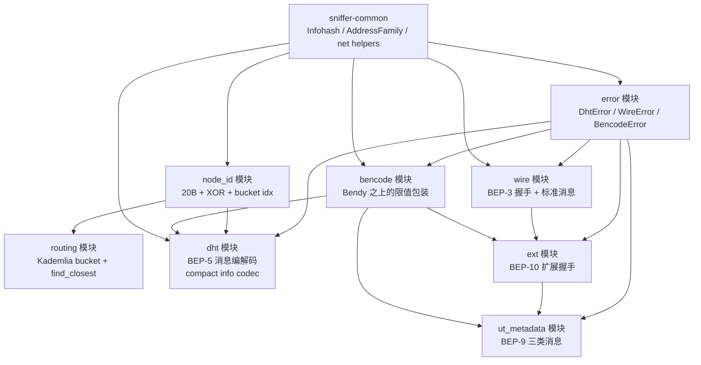
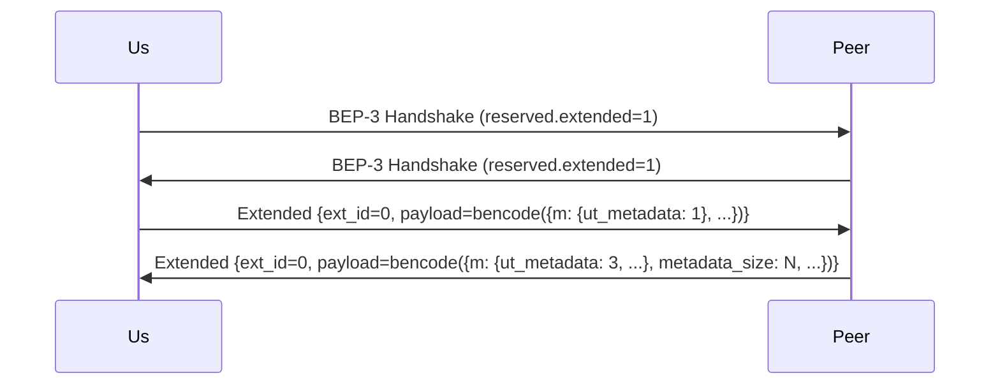

# Slice 6 — BT 协议引擎基础

> 上一片：[Slice 5 — agent 骨架与生命周期](../05-agent-skeleton/index.md)

## 1. 目标与范围

把 `sniffer-dht` crate 从 Slice 1 的占位升级到**完整可用的 BT 协议基础库**：bencode、DHT 消息编解码（BEP-5）、Kademlia 路由表、peer wire 协议（BEP-3）、扩展握手（BEP-10）、ut_metadata（BEP-9）。**纯库 + 单元测试**，不含网络 IO 与爬取策略，不在 agent 进程里运行。

**范围内**：

- 依赖补全：bendy / bytes / sha1 / rand / time（其中 time 已 workspace 声明）。
- **bencode 包装**：`bendy` 之上的 `BencodeError`、安全限值（max depth / max int / max string size）。
- **DHT node id**：20 字节、XOR 距离、随机生成、bucket index 计算。
- **Kademlia 路由表**：bucket 数据结构 + insert / touch / find_closest / 持久化的接口（序列化由 Slice 7 决定具体格式）。
- **DHT 消息（BEP-5 + BEP-32 双栈）**：`ping` / `find_node` / `get_peers` / `announce_peer` 三种 query 和三种 response 的领域模型 + bencode 编解码 + transaction id 类型。
- **compact node info / compact peer info 编码**（v4 + v6）。
- **peer wire（BEP-3）**：握手帧 + 标准消息枚举的编解码骨架（重点：握手 + extension 相关消息；piece 数据传输**故意不实现**，避免被业务误用）。
- **扩展握手（BEP-10）**：扩展消息总框架、`m` 字典、本端宣告支持 `ut_metadata`。
- **ut_metadata（BEP-9）**：request / data / reject 消息的 bencode + payload 拼装。
- **类型化错误**：`DhtError` / `WireError` / `BencodeError`。
- **测试**：单元测试覆盖 BEP 文档示例向量 + 自构造边界数据 + 恶意输入（深度炸弹、超大字符串）。

**范围外**：所有网络 IO（UDP 收发 / TCP 连接）→ Slice 7 / 8。爬取调度策略 → Slice 7。BEP-9 完整抓取状态机（请求多分片、组装、sha1 校验循环）→ Slice 8。announce_peer 业务策略 → Slice 7。路由表持久化的存储格式与时机 → Slice 7。

## 2. crate 总览



`sniffer-dht` 仅依赖 `sniffer-common` + 第三方库（bendy / bytes / sha1 / rand / time / thiserror）。**不依赖** `sniffer-protocol`（保持解耦，BT 引擎产出原始观测由 agent 转 protocol 消息）。

## 3. 文件组织

```text
sniffer-dht/
├── Cargo.toml
└── src/
    ├── lib.rs              # pub mod ...; re-export 常用类型
    ├── error.rs            # DhtError / WireError / BencodeError / MetadataError
    ├── bencode/
    │   ├── mod.rs          # 入口: encode / decode + 限值配置
    │   ├── limits.rs       # max_depth / max_int / max_string_len 等
    │   └── value.rs        # bendy 之上的 Value 中间表示 (供 dht/ext/metadata 用)
    ├── node_id.rs          # NodeId([u8; 20]) + xor 距离 + 随机生成 + leading_zeros
    ├── routing/
    │   ├── mod.rs          # RoutingTable: find_closest / insert / touch
    │   ├── bucket.rs       # KBucket: 8 节点上限 / replacement cache
    │   └── entry.rs        # NodeEntry: NodeId + SocketAddr + first_seen / last_seen / status
    ├── dht/
    │   ├── mod.rs          # 入口: Query / Response / ErrorMsg + encode / decode
    │   ├── message.rs      # 三类 query / 三类 response 的结构体
    │   ├── tx.rs           # TransactionId(Bytes) + 生成器
    │   └── compact.rs      # compact_v4 / compact_v6 编解码 (重新导出 common::net 的, 加 nodes 数组形态)
    ├── wire/
    │   ├── mod.rs          # 入口: Handshake / Message
    │   ├── handshake.rs    # 68 字节固定 handshake
    │   ├── message.rs      # Message 枚举: KeepAlive/Choke/.../Extended; 编解码
    │   └── reserved.rs     # reserved 8 字节中标 BEP-10 / BEP-5 等支持位
    ├── ext/
    │   ├── mod.rs          # 扩展握手协议: ExtendedHandshake
    │   └── handshake.rs    # m 字典 + metadata_size 等字段
    └── metadata/
        ├── mod.rs          # BEP-9 三类消息: Request / Data / Reject
        ├── piece.rs        # piece 切片常量 (16 KiB) + 总分片计算
        └── assembler.rs    # (接口而非完整状态机) 分片接收容器, sha1 校验
```

## 4. bencode 包装

### 4.1 为什么不直接用 Bendy

Bendy 是相对成熟的 zero-alloc bencode 库，但**默认不限值**。BT 网络上有恶意 peer 会发：

- 超深嵌套字典（栈炸弹）
- 超长字符串（内存炸弹）
- 超大整数（拒绝服务）

直接 `bendy::serde::from_bytes` 在恶意输入下可能 OOM 或栈溢出。我们包一层 + 限值。

### 4.2 限值

```rust
pub struct BencodeLimits {
    pub max_depth: usize,           // 默认 32
    pub max_int_digits: usize,      // 默认 19 (i64 最大)
    pub max_string_len: usize,      // 默认 1 MiB (一般 BT 消息远小于此)
    pub max_list_items: usize,      // 默认 65535
    pub max_dict_keys: usize,       // 默认 65535
    pub max_total_size: usize,      // 默认 4 MiB (DHT 消息更小; metadata 由专用更大限值)
}

impl Default for BencodeLimits { /* DHT 用 */ }

impl BencodeLimits {
    /// metadata 抓取专用: max_total_size 放宽到 16 MiB (BEP-9 metadata_size 上限)
    pub fn for_metadata() -> Self { ... }
}
```

### 4.3 API

```rust
// bencode/mod.rs
pub fn decode<T>(bytes: &[u8], limits: &BencodeLimits) -> Result<T, BencodeError>
where
    T: serde::de::DeserializeOwned;

pub fn encode<T>(value: &T) -> Result<Vec<u8>, BencodeError>
where
    T: serde::Serialize;

// 中间形态: 不需要强类型时
pub fn decode_value(bytes: &[u8], limits: &BencodeLimits) -> Result<Value, BencodeError>;
pub fn encode_value(v: &Value) -> Result<Vec<u8>, BencodeError>;

pub enum Value {
    Int(i64),
    Bytes(Bytes),
    List(Vec<Value>),
    Dict(BTreeMap<Bytes, Value>),    // BTreeMap 保证 bencode key 字典序
}
```

> **重要**：bencode 字典 key 必须按字节字典序排序（BEP-3 规定）。`BTreeMap<Bytes, _>` 天然满足。`bendy` 也强制这一点。

### 4.4 错误类型

```rust
#[derive(thiserror::Error, Debug)]
pub enum BencodeError {
    #[error("max depth {limit} exceeded")]
    DepthExceeded { limit: usize },
    #[error("string length {got} exceeds limit {limit}")]
    StringTooLong { got: usize, limit: usize },
    #[error("integer too long: {got} digits")]
    IntTooLong { got: usize },
    #[error("dict keys not in canonical order")]
    KeysNotSorted,
    #[error("unexpected end of input")]
    UnexpectedEof,
    #[error("invalid bencode: {0}")]
    Invalid(String),
    #[error("total size {got} exceeds limit {limit}")]
    TotalTooLarge { got: usize, limit: usize },
    #[error(transparent)]
    Bendy(#[from] bendy::serde::Error),
}
```

## 5. node_id

```rust
// node_id.rs
#[derive(Copy, Clone, Eq, PartialEq, Hash, Ord, PartialOrd)]
pub struct NodeId([u8; 20]);

impl NodeId {
    pub const fn from_bytes(b: [u8; 20]) -> Self;
    pub fn random() -> Self;                          // 全随机, agent 启动时单次生成
    pub fn random_with_prefix(prefix: &[u8]) -> Self; // 用于路由表 bootstrap "找邻居"
    pub const fn as_bytes(&self) -> &[u8; 20];
    pub fn to_hex(&self) -> String;
    pub fn from_hex(s: &str) -> Result<Self, DhtError>;
}

// XOR 距离 (无方向): 同样 20 字节
#[derive(Copy, Clone, Eq, PartialEq, Ord, PartialOrd)]
pub struct Distance([u8; 20]);

impl NodeId {
    /// distance(a, b) = a XOR b
    pub fn distance(&self, other: &NodeId) -> Distance;

    /// bucket 索引: 从 self 看 other 的距离的前导零位数 (0..160)
    /// 用于 Kademlia 路由表分桶
    pub fn bucket_index(&self, other: &NodeId) -> usize;
}

impl Distance {
    /// 距离的高位前导零数 (距离越近, 前导零越多)
    pub fn leading_zeros(&self) -> u32;
}
```

实现要点：

- `bucket_index` 内部就是 `distance.leading_zeros() as usize`；越小的 index 越远，最大 159（160 个 bucket，对应 160 位 ID）。
- `random()` 用 `rand::thread_rng().fill_bytes(&mut [0u8; 20])`。
- v4 与 v6 各自独立的 node_id（agent 配置时分两份），但本模块不区分 —— 区分逻辑在 routing 模块（每个 family 一棵路由表）。

## 6. Kademlia 路由表

### 6.1 数据结构

```rust
// routing/entry.rs
#[derive(Clone)]
pub struct NodeEntry {
    pub id: NodeId,
    pub addr: SocketAddr,              // v4 或 v6
    pub first_seen: OffsetDateTime,
    pub last_seen: OffsetDateTime,
    pub status: NodeStatus,
    pub fail_count: u32,               // 连续未响应次数; 超过阈值标 bad
}

#[derive(Copy, Clone, Eq, PartialEq)]
pub enum NodeStatus {
    Good,                              // 最近 15 分钟有响应
    Questionable,                      // 15-30 分钟未联系
    Bad,                               // 超过 30 分钟或 fail_count >= 3
}

// routing/bucket.rs
pub struct KBucket {
    entries: Vec<NodeEntry>,           // 最多 K=8
    replacement: VecDeque<NodeEntry>,  // 候补; 满 bucket 时新 good node 入这里, 等 bad 被替换
    range_start: NodeId,               // 该 bucket 覆盖的 ID 范围 (用于 split)
    range_end: NodeId,
}

// routing/mod.rs
pub struct RoutingTable {
    self_id: NodeId,                   // 本 agent 的 node id (该 family)
    family: AddressFamily,             // V4 或 V6
    buckets: Vec<KBucket>,
}
```

### 6.2 关键 API

```rust
impl RoutingTable {
    pub fn new(self_id: NodeId, family: AddressFamily) -> Self;

    /// 见过一个节点 (从查询响应中提取出来的): 决定 insert / touch / drop
    pub fn observe(&mut self, entry: NodeEntry);

    /// 查找距离 target 最近的 N 个 good/questionable 节点 (find_node 响应用)
    pub fn find_closest(&self, target: &NodeId, n: usize) -> Vec<NodeEntry>;

    /// 收到指定 node 的有效响应时更新 last_seen + status=Good
    pub fn on_response(&mut self, id: &NodeId);

    /// 查询超时 / 错误时: fail_count++, 必要时标 Bad
    pub fn on_timeout(&mut self, id: &NodeId);

    /// 路由表中节点总数 (供心跳指标用)
    pub fn len(&self) -> usize;

    /// 序列化为持久化形态 (具体格式 Slice 7 定; 这里仅暴露接口)
    pub fn snapshot(&self) -> RoutingSnapshot;
    pub fn restore(snapshot: RoutingSnapshot, self_id: NodeId, family: AddressFamily) -> Self;
}
```

### 6.3 bucket split 策略

经典 Kademlia 实现：

- 初始 1 个 bucket 覆盖全 ID 空间。
- 插入新节点时，若**目标 bucket 满**且该 bucket **包含 self_id**，则 split 成两个子 bucket，新节点放对应一个。
- 若**目标 bucket 满**且**不**包含 self_id，新节点入 replacement queue，等该 bucket 内某节点被标 Bad 时被替换。

这是 BEP-5 推荐做法，本片就这样实现。**不**为了优化偏离规范（如 "always split"）。

### 6.4 双栈两张路由表

v4 与 v6 是**独立** DHT 网络（BEP-32 明确区分），各自维护：

```rust
pub struct DualStackTable {
    pub v4: Option<RoutingTable>,
    pub v6: Option<RoutingTable>,
}
```

agent 启动时按 config 决定建哪些表（如 IPv6 不可用就只建 v4）。Slice 7 的 DHT 爬虫在两张表上各跑各的。

## 7. DHT 消息（BEP-5）

### 7.1 消息形态总览

KRPC（DHT 用的 RPC 协议）所有消息都是 bencode 字典，顶层有：

| 键 | 类型 | 含义 |
| --- | --- | --- |
| `t` | bytes | transaction id (1-4 字节随机) |
| `y` | bytes | "q"（query）/ "r"（response）/ "e"（error） |
| `q` | bytes | query 类型（仅 y=q 时） |
| `a` | dict | query 参数（仅 y=q 时） |
| `r` | dict | response 数据（仅 y=r 时） |
| `e` | list | [错误码, 错误文本]（仅 y=e 时） |
| `v` | bytes | 可选 client 标识（前缀 + 版本） |

### 7.2 领域模型

```rust
// dht/message.rs

// 顶层包装
pub enum Message {
    Query(TransactionId, Query),
    Response(TransactionId, Response),
    Error(TransactionId, ErrorMsg),
}

pub struct TransactionId(pub Bytes);          // 1-4 字节

impl TransactionId {
    pub fn random_short() -> Self;            // 2 字节随机, agent 端常用
}

pub enum Query {
    Ping(PingArgs),
    FindNode(FindNodeArgs),
    GetPeers(GetPeersArgs),
    AnnouncePeer(AnnouncePeerArgs),
}

pub enum Response {
    Ping(PingResp),                           // 仅 id
    FindNode(FindNodeResp),                   // nodes (v4 或 v6) compact
    GetPeers(GetPeersResp),                   // values 或 nodes + token
    AnnouncePeer(AnnouncePeerResp),           // 仅 id
}

pub struct PingArgs {
    pub id: NodeId,                           // sender id
}

pub struct FindNodeArgs {
    pub id: NodeId,
    pub target: NodeId,
    pub want: WantFamilies,                   // BEP-32: want = ["n4", "n6"]
}

pub struct GetPeersArgs {
    pub id: NodeId,
    pub info_hash: Infohash,
    pub want: WantFamilies,
}

pub struct AnnouncePeerArgs {
    pub id: NodeId,
    pub info_hash: Infohash,
    pub port: u16,
    pub token: Bytes,                         // 来自之前 get_peers 响应
    pub implied_port: bool,                   // BEP-5: 用源端口而非 port 字段
}

pub struct FindNodeResp {
    pub id: NodeId,
    pub nodes_v4: Vec<CompactNode>,           // BEP-5 nodes 字段
    pub nodes_v6: Vec<CompactNode>,           // BEP-32 nodes6 字段
}

pub struct GetPeersResp {
    pub id: NodeId,
    pub token: Bytes,
    pub values: Vec<SocketAddr>,              // 命中: 直接的 peer 列表
    pub nodes_v4: Vec<CompactNode>,           // 未命中: 转介
    pub nodes_v6: Vec<CompactNode>,
}

pub struct CompactNode {
    pub id: NodeId,
    pub addr: SocketAddr,                     // v4 或 v6, 由字段长度决定
}

pub struct ErrorMsg {
    pub code: i64,                            // 201 generic / 202 server / 203 protocol / 204 method unknown
    pub message: String,
}

pub struct WantFamilies {
    pub v4: bool,
    pub v6: bool,
}

impl WantFamilies {
    pub const BOTH: Self = Self { v4: true, v6: true };
    pub const V4: Self = Self { v4: true, v6: false };
    pub const V6: Self = Self { v4: false, v6: true };
}
```

### 7.3 编解码 API

```rust
// dht/mod.rs
pub fn encode(msg: &Message) -> Result<Vec<u8>, DhtError>;
pub fn decode(bytes: &[u8]) -> Result<Message, DhtError>;
```

实现：bencode 字典 → Value → 按 `y` 字段分发到具体 Args/Resp 解析。编码反过来。

### 7.4 BEP-32 IPv6 处理细节

- `find_node` / `get_peers` 响应中 `nodes` 是 6+20=26 字节 v4 节点列表的连接；`nodes6` 是 18+20=38 字节 v6 节点列表。
- `get_peers` 响应中 `values` 是 6 字节 v4 peer 或 18 字节 v6 peer 字符串列表（每个元素一个 peer）；同一响应可同时含 v4 + v6 peer。
- `want` 字段是 `["n4"]` / `["n6"]` / `["n4", "n6"]`，表示请求者希望对方返回哪些家族的节点。

### 7.5 compact 编码

复用 Slice 1 `sniffer-common::net::{compact_v4, compact_v6, parse_compact_v4, parse_compact_v6}`，在 `dht/compact.rs` 加 nodes 数组拼接/拆分：

```rust
pub fn encode_compact_nodes_v4(nodes: &[CompactNode]) -> Vec<u8>;
pub fn decode_compact_nodes_v4(bytes: &[u8]) -> Result<Vec<CompactNode>, DhtError>;
// v6 同模式
```

每个 v4 node 是 20+6=26 字节连续；v6 是 20+18=38 字节。长度不对齐就报错。

## 8. peer wire 协议（BEP-3）

### 8.1 握手帧

固定 68 字节：

```text
+----+----+----+----+----+----+----+----+----+--------+----+
| 19 | "BitTorrent protocol" (19 bytes) | rsv 8B | infohash 20B | peer_id 20B |
+----+----+----+----+----+----+----+----+----+--------+----+
```

```rust
// wire/handshake.rs
pub struct Handshake {
    pub reserved: ReservedBits,
    pub info_hash: Infohash,
    pub peer_id: [u8; 20],
}

impl Handshake {
    pub fn encode(&self) -> [u8; 68];
    pub fn decode(bytes: &[u8]) -> Result<Self, WireError>;
}
```

### 8.2 reserved 位

```rust
// wire/reserved.rs
pub struct ReservedBits(pub [u8; 8]);

impl ReservedBits {
    pub const fn new() -> Self;                       // 全 0
    pub fn with_extended(self) -> Self;               // BEP-10: byte 5 bit 0x10
    pub fn with_dht(self) -> Self;                    // BEP-5: byte 7 bit 0x01
    pub fn supports_extended(&self) -> bool;
    pub fn supports_dht(&self) -> bool;
}
```

agent 默认开 `extended`（BEP-10）位，不开 `dht`（我们不通过 peer 协议宣告自己是 DHT 节点，DHT 走 UDP 独立通道）。

### 8.3 标准消息

```rust
// wire/message.rs
pub enum Message {
    KeepAlive,                       // 4 字节 0
    Choke,                           // id=0
    Unchoke,                         // id=1
    Interested,                      // id=2
    NotInterested,                   // id=3
    Have(u32),                       // id=4 + piece index
    Bitfield(Bytes),                 // id=5
    Request { index: u32, begin: u32, length: u32 },     // id=6
    Piece { index: u32, begin: u32, block: Bytes },      // id=7 -- 故意不组装数据
    Cancel { index: u32, begin: u32, length: u32 },      // id=8
    Port(u16),                       // id=9, BEP-5 DHT 端口宣告
    Extended { ext_id: u8, payload: Bytes },             // id=20, BEP-10
}

impl Message {
    pub fn encode(&self) -> Bytes;
    pub fn decode_frame(bytes: &[u8]) -> Result<(Self, usize), WireError>;  // 返回消息 + 消耗字节数
}
```

**为什么仍声明 `Request` / `Piece` / `Cancel` 但不实现"组装数据"**：

- 我们仍要解码这些消息（peer 可能给我们发，我们要丢弃而不是 panic）。
- 但**业务层永远不调用 encode 这些消息**（除非将来要做完整 BT 客户端 —— 不在本项目目标）。
- `Piece` 的 `block` 字段在解码时占用内存，但我们**收到立即 drop**，不持久化、不组装。这是"不污染 BT 网络"原则的代码层保障。

### 8.4 长度前缀

所有非握手消息都是 `[4 字节大端长度] + [1 字节 id] + [payload]`。`decode_frame` 处理增量解码（输入字节不足时返回 `WireError::Incomplete(need)`），让 Slice 8 的 `tokio_util::codec` 集成自然。

## 9. 扩展握手（BEP-10）

### 9.1 流程



两端先做 BEP-3 握手并互相确认 extended 位；然后各自发送 ext_id=0 的 Extended 消息，里面 bencode payload 是扩展握手。`m` 字典告诉对方"我把 `ut_metadata` 这个扩展协议分配了哪个本端的 ext_id"。

### 9.2 领域模型

```rust
// ext/handshake.rs
pub struct ExtendedHandshake {
    pub m: BTreeMap<String, u8>,        // 扩展名 -> 本端 ext_id (0 = 不支持)
    pub metadata_size: Option<u64>,     // BEP-9: 对方知道的 info dict 大小
    pub p: Option<u16>,                 // 对方监听 TCP 端口
    pub v: Option<String>,              // 客户端版本字符串
    pub ipv4: Option<Ipv4Addr>,         // 对方观察到的我方公网 ip (BEP-10)
    pub ipv6: Option<Ipv6Addr>,
    pub reqq: Option<u32>,              // 对方愿意接受的 outstanding request 数
}

impl ExtendedHandshake {
    /// 本端宣告: 我们支持 ut_metadata, 分配 ext_id = 3
    pub fn ours_for_metadata_fetch() -> Self;
    pub fn encode_payload(&self) -> Result<Bytes, BencodeError>;
    pub fn decode_payload(bytes: &[u8]) -> Result<Self, BencodeError>;
}
```

`ours_for_metadata_fetch` 返回的握手内容：

```text
m: { "ut_metadata": 3 }
v: "magnet-sniffer 0.1.0"
reqq: 50
```

我们既不宣告 `p`（监听端口，可能 NAT 后无意义），也不发 `metadata_size`（我们是抓取方，不持有 metadata）。

### 9.3 接收对方的握手

```rust
// 从对方拿到 ext_id=0 的 Extended 消息后:
let their = ExtendedHandshake::decode_payload(&payload)?;
let their_ut_metadata_id = their.m.get("ut_metadata").copied().unwrap_or(0);
let metadata_size = their.metadata_size.unwrap_or(0);

if their_ut_metadata_id == 0 {
    // 对方不支持 ut_metadata, fetch_failure_kind=NO_UT_METADATA, 断开
}
if metadata_size == 0 || metadata_size > MAX_METADATA_SIZE {
    // metadata 大小不合理, fetch_failure_kind=METADATA_SIZE_OVERFLOW, 断开
}
```

`MAX_METADATA_SIZE` 设为 16 MiB（业界普遍上限；超过这个值的 metadata 几乎肯定是恶意 peer）。

## 10. ut_metadata（BEP-9）

### 10.1 piece 切分

info dict 按 16 KiB 切分。`metadata_size=N` → 总 piece 数 `ceil(N / 16384)`。

```rust
// metadata/piece.rs
pub const PIECE_SIZE: usize = 16 * 1024;
pub const MAX_METADATA_SIZE: u64 = 16 * 1024 * 1024;  // 16 MiB

pub fn piece_count(metadata_size: u64) -> usize {
    ((metadata_size + PIECE_SIZE as u64 - 1) / PIECE_SIZE as u64) as usize
}

pub fn piece_range(idx: usize, metadata_size: u64) -> Range<usize> {
    let start = idx * PIECE_SIZE;
    let end = std::cmp::min(start + PIECE_SIZE, metadata_size as usize);
    start..end
}
```

### 10.2 三类消息

每条 ut_metadata 消息都是包在 BEP-10 Extended 帧里的 bencode payload，但**特殊点**：data 消息的 bencode payload 后**紧接着 16 KiB 二进制 piece**（不在 bencode 内）。

```rust
// metadata/mod.rs
pub enum UtMetadataMessage {
    Request { piece: u32 },                 // {msg_type: 0, piece: N}
    Data { piece: u32, total_size: u64, block: Bytes },  // {msg_type: 1, piece: N, total_size: N} + raw block
    Reject { piece: u32 },                  // {msg_type: 2, piece: N}
}

impl UtMetadataMessage {
    pub fn encode(&self) -> Bytes;                     // 含尾部 raw block (Data 时)
    pub fn decode(bytes: &[u8]) -> Result<Self, MetadataError>;
}
```

decode 处理"bencode + 尾部裸字节"的细节：

1. 用 `bendy` 流式解析直到字典结束，记录消耗字节数 `consumed`。
2. 若 `msg_type=1`（Data），剩余 `bytes[consumed..]` 即 block 内容（长度由调用方按 piece_range 确认）。
3. 其他类型：剩余必须为空，否则 `MetadataError::TrailingGarbage`。

### 10.3 assembler 接口（不是状态机）

```rust
// metadata/assembler.rs
pub struct MetadataAssembler {
    expected_size: u64,
    expected_pieces: usize,
    expected_infohash: Infohash,
    received: Vec<Option<Bytes>>,            // 长 expected_pieces
}

impl MetadataAssembler {
    pub fn new(expected_size: u64, expected_infohash: Infohash) -> Result<Self, MetadataError>;

    /// 接收一个 piece; 返回是否已完整
    pub fn add_piece(&mut self, idx: usize, block: Bytes) -> Result<bool, MetadataError>;

    /// 完整后调用: 拼装 + sha1 校验; 通过则返回 info_dict 字节
    pub fn finalize(self) -> Result<Bytes, MetadataError>;

    pub fn missing_pieces(&self) -> Vec<usize>;
    pub fn progress(&self) -> (usize, usize);   // (received, total)
}
```

**关键的 sha1 校验**：`finalize` 内部 `sha1(info_dict)` 与 `expected_infohash` 比对，不匹配 → `MetadataError::Sha1Mismatch`，agent 端转 `FETCH_FAILURE_KIND_SHA1_MISMATCH` 上报恶意行为信号（伪 metadata 是 Slice 11 Sybil/poisoning 分析的关键证据）。

**为什么不是完整状态机**：什么时候发 Request、超时怎么处理、并发多少个 piece 同时请求 —— 这些是**协议使用策略**，归 Slice 8（元数据抓取）。Slice 6 只给"装数据 + 验数据"的容器。

### 10.4 错误类型

```rust
#[derive(thiserror::Error, Debug)]
pub enum MetadataError {
    #[error("metadata size {0} exceeds limit {limit}", limit = MAX_METADATA_SIZE)]
    SizeTooLarge(u64),
    #[error("piece index {idx} out of bounds (total={total})")]
    PieceOutOfBounds { idx: usize, total: usize },
    #[error("duplicate piece {0}")]
    DuplicatePiece(usize),
    #[error("piece {idx} size mismatch: got {got}, expected {expected}")]
    PieceSizeMismatch { idx: usize, got: usize, expected: usize },
    #[error("sha1 mismatch: peer is forging metadata")]
    Sha1Mismatch,
    #[error("trailing garbage after bencode in ut_metadata message")]
    TrailingGarbage,
    #[error("bencode: {0}")]
    Bencode(#[from] BencodeError),
}
```

## 11. 错误类型整体

```rust
// error.rs
#[derive(thiserror::Error, Debug)]
pub enum DhtError {
    #[error(transparent)]
    Bencode(#[from] BencodeError),
    #[error("missing required field: {0}")]
    MissingField(&'static str),
    #[error("unknown query type: {0}")]
    UnknownQuery(String),
    #[error("unknown response shape (no nodes/values/token)")]
    UnknownResponseShape,
    #[error("invalid transaction id length: {0}")]
    InvalidTransactionId(usize),
    #[error("invalid compact node bytes length: {0}")]
    InvalidCompactLen(usize),
    #[error("invalid ip / port")]
    InvalidAddress,
    #[error("invalid node id length: {0}")]
    InvalidNodeId(usize),
    #[error(transparent)]
    Common(#[from] sniffer_common::CommonError),
}

#[derive(thiserror::Error, Debug)]
pub enum WireError {
    #[error("handshake too short: {0}")]
    HandshakeTooShort(usize),
    #[error("handshake bad pstrlen: {0}")]
    HandshakeBadPstrlen(u8),
    #[error("handshake bad pstr: {0:?}")]
    HandshakeBadPstr(Vec<u8>),
    #[error("frame incomplete, need {0} more bytes")]
    Incomplete(usize),
    #[error("frame too large: {got} > {limit}")]
    FrameTooLarge { got: u32, limit: u32 },
    #[error("unknown message id: {0}")]
    UnknownMessageId(u8),
    #[error("invalid message body")]
    InvalidBody,
}
```

`DhtError` 与 `WireError` 是 lib 边界类型；agent 端把它们映射成 `FetchFailureKind`（如 `HandshakeTooShort` / `HandshakeBadPstr` → `HANDSHAKE_FAIL`）或丢日志。

## 12. 测试策略

### 12.1 BEP 规范向量

- BEP-5 文档示例里有 ping / find_node / get_peers / announce_peer 的字节流示例（"sample krpc"）。Slice 6 把这些固定字节硬编码进单元测试，断言 decode → 强类型 → encode 后字节级相等。
- BEP-9 有完整 metadata 抓取过程的示例字节。同样硬编码 + round-trip。
- BEP-10 扩展握手有示例 bencode。

### 12.2 自构造边界

- bencode：超深字典（试图栈炸弹）、超大字符串（试图内存炸弹）、字典 key 乱序、未终止串、数值溢出 → 期望返回 `BencodeError::*`，**不**应 panic 或 OOM。
- DHT：缺字段（`q` 缺失、`a` 不是字典）、未知 query 类型、compact nodes 长度非 26/38 倍数。
- wire：握手 pstrlen 非 19、协议名错误、frame 长度声明大于实际、id 未知。
- ut_metadata：piece 索引越界、重复 piece、piece 大小错（中间 piece 必须是 16 KiB，最后一个是余数）、bencode 字典 + 尾部 garbage、sha1 不匹配。

### 12.3 round-trip 性质测试（可选）

如果引入 `proptest` 做属性测试：随机生成合法领域对象 → encode → decode → 期望等于原对象。Slice 6 阶段不强制，但留接口（用 `#[cfg(test)]` 加 `proptest` dev-dependency）。

### 12.4 真实抓包样本

从真实 BT 客户端（qBittorrent / libtorrent）抓一些 DHT / peer wire 包，存进 `tests/fixtures/`，用作集成测试样本（仍是单元粒度，没有网络 IO）。具体抓包流程在文档"附录"提示，但**不在 Slice 6 强制要求**（避免给实施增加阻塞），有条件可加。

## 13. 关键技术取舍

### 13.1 不实现 BT 完整 piece 下载

`Message::Piece` / `Message::Request` / `Message::Cancel` 仅在解码层存在（peer 发过来不 panic），**不在 agent 业务中调用 encode**。这是"被动嗅探、零文件传输"伦理原则的代码层保障 —— 我们想下载 piece 也得手工绕过类型系统。

### 13.2 bencode 强制限值

Bendy 自身有一些保护，但限值不是它的强项。我们包一层 + 配置化限值，DHT 路径用 4 MiB，metadata 路径用 16 MiB；agent 解析每条消息前**显式选择 limits 实例**。

### 13.3 双栈在路由表层而非消息层

DHT 消息编解码是**双栈混合**（同一消息可同时含 v4 + v6 数据）。但路由表是**两张分开**（v4 一张 / v6 一张）—— 因为 Kademlia 的距离度量在 ID 空间内，与 IP 家族无关，但**节点的可达性**与家族绑定，混路由会出现"在 v4 路由表里给出 v6 节点结果"的混乱。两张表分开是工程清晰度。

### 13.4 routing 持久化格式 Slice 7 才定

Slice 6 暴露 `snapshot` / `restore` 接口的 `RoutingSnapshot` 类型，但**不**确定其内部布局（JSON / postcard / bincode / 自定义 bencode）。Slice 7 在决定路由表持久化策略（多频繁持久化、什么时机加载）时一起定。

### 13.5 ut_metadata 不带状态机

如 §10.3。BEP-9 的实际抓取需要：何时发 Request、并发几个、超时怎么重发、收到 Reject 怎么处理 —— 这些是策略层。本片只提供"装 + 验"。

### 13.6 标准消息 id=9 (Port) 仍解码但 agent 不发

`Port` 消息让 peer 告诉对方"我的 DHT 监听 UDP 端口"。我们不向 peer 主动宣告（避免被识别为 DHT 节点带来额外查询压力），但解码兼容 —— 收到丢弃。

### 13.7 transaction id 用 2 字节随机

KRPC 允许 1-4 字节。2 字节给 65536 种区分，足够 agent 端的 outstanding 查询数（默认 max=100，按 §RatelimitConfig）。1 字节碰撞太多；4 字节浪费。

## 14. 验收标准

- `cargo build -p sniffer-dht` 成功（在 `SQLX_OFFLINE=true` 下与 workspace 一起编译）。
- `cargo test -p sniffer-dht` 全绿；至少覆盖：
  - BEP-5 ping / find_node / get_peers / announce_peer 各自的 query / response / error 的 round-trip。
  - BEP-32 nodes6 + want=["n4","n6"] 的 get_peers 响应解析。
  - 恶意输入：深度炸弹（depth=33）→ `DepthExceeded`；超长字符串 → `StringTooLong`；非字典序 key → `KeysNotSorted`。
  - BEP-3 握手 round-trip + reserved bits 标志位。
  - BEP-10 扩展握手 round-trip。
  - BEP-9 三类消息 round-trip；Data 消息的 bencode + 尾部 block 拆分。
  - `MetadataAssembler` 完整抓取流程（构造一份小 metadata，分 piece 投递，finalize sha1 匹配）。
  - `MetadataAssembler::Sha1Mismatch`（构造 piece 时改一字节，验失败）。
  - `NodeId::distance` + `bucket_index` 已知向量（如 distance(0, 1<<159) 的 leading_zeros=0）。
  - `RoutingTable::observe` 满 bucket 时 split 行为（self_id 在该 bucket 内）+ 不 split 行为（self_id 不在）。
  - `RoutingTable::find_closest(target, 8)` 返回的节点按距离单调递增。
- `cargo clippy -p sniffer-dht -- -D warnings` 全绿。
- `cargo doc -p sniffer-dht --no-deps` 无 broken intra-doc link；公共 API 都有文档注释。
- 模块树与 §3 一致，每个 mod 都有 `//! ...` crate-level doc。

## 15. 后续延伸

- DHT 爬虫调度（find_node 循环、get_peers 扩散、token 管理、announce_peer 策略、outstanding 查询限速）→ Slice 7。
- 路由表持久化格式 + 启动恢复 + 周期 dump → Slice 7 决定。
- BEP-9 完整抓取状态机（按 progress 持续发 Request、重试 Reject、超时机制、并发分片）→ Slice 8。
- peer wire 网络层（tokio AsyncRead/Write 适配 + 帧 codec）→ Slice 8 接 `tokio_util::codec::Decoder`。
- 真实抓包样本入 `tests/fixtures/` → 实施时可选增强。
- proptest 属性测试 → 可选增强。
- BEP-44 / BEP-46（mutable / immutable DHT items）→ 不在当前路线图。
