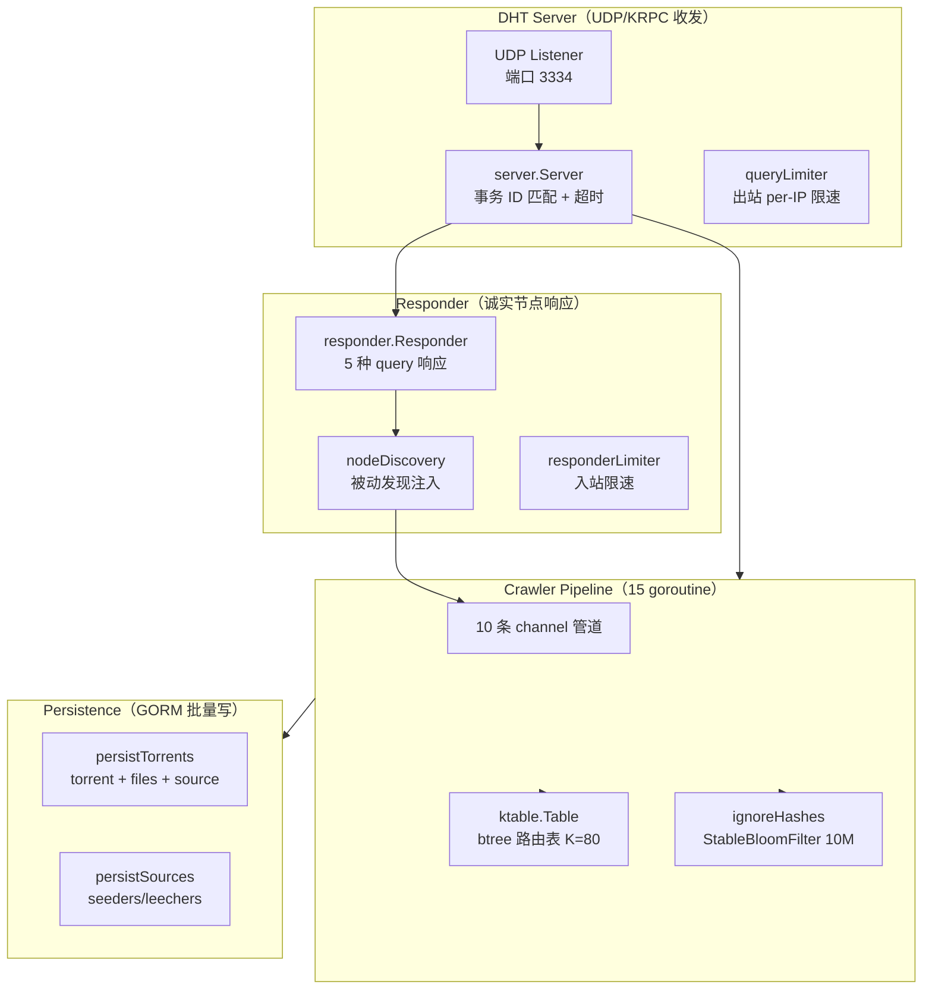
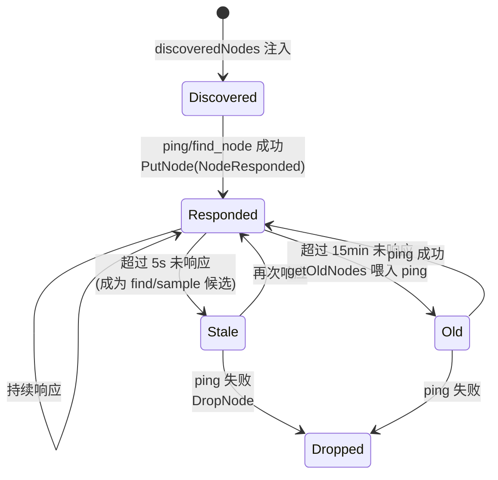
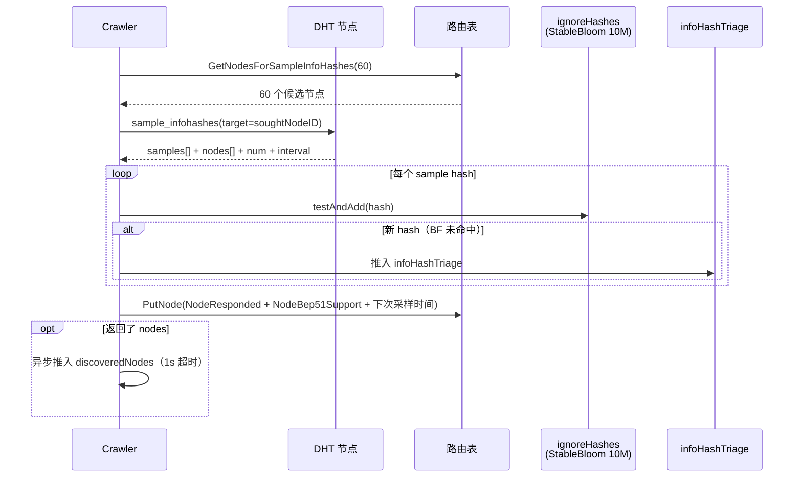
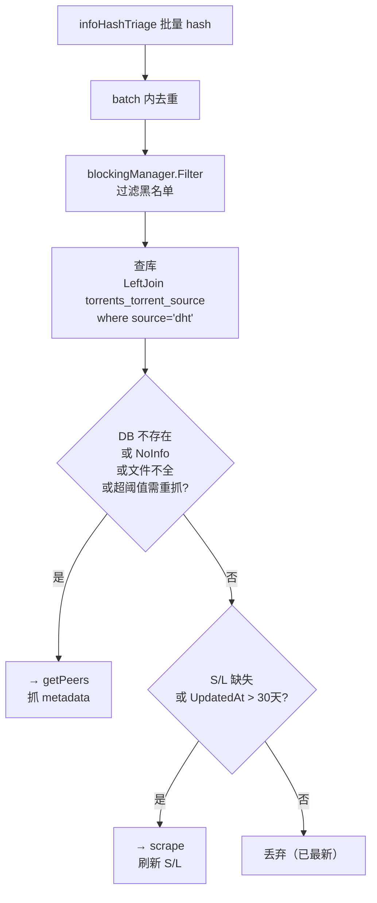
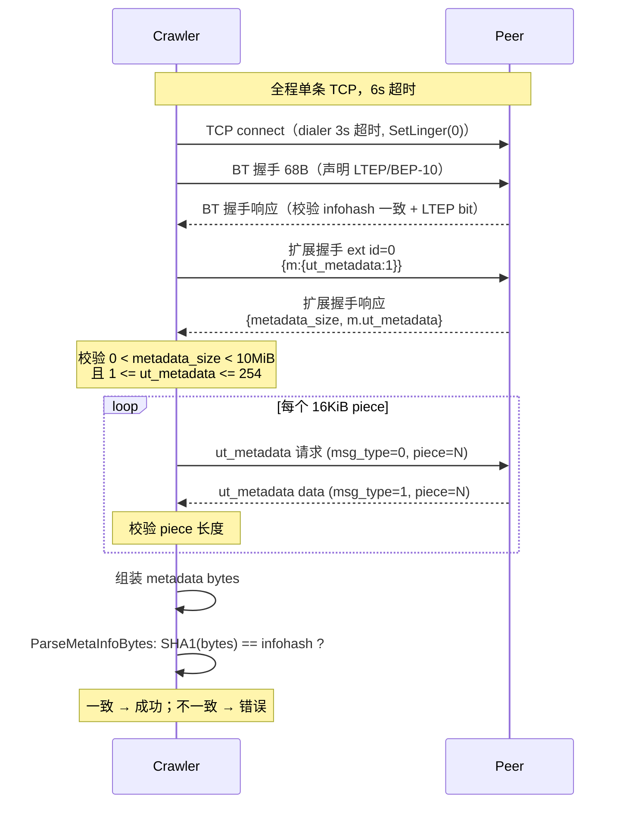
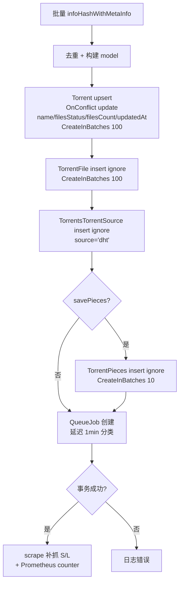
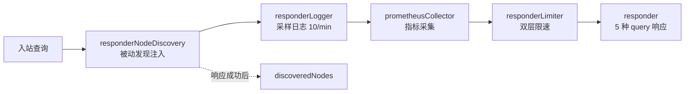

# bitmagnet DHT 爬虫实现剖析

> 关联文档：magnet-sniffer [Slice 6 — BT 协议引擎](../06-bt-engine/index.md) / Slice 7 — DHT 爬取（待讨论）  
> 源码版本：bitmagnet `main` 分支（克隆于 2026-06，以 `internal/dhtcrawler` + `internal/protocol/dht` 为准）  
> 本文是**参考资料**，剖析 bitmagnet 的实现做法与缘由，不构成 magnet-sniffer 的设计决策。设计决策留给后续 Slice 7。  
> 推荐阅读顺序：§2 总体 → §4 管道（核心）→ §6/§7/§8/§9 各协议阶段 → §11 诚实节点面 → §13 启示

## §1 背景与定位

[bitmagnet](https://github.com/bitmagnet-io/bitmagnet) 是一个自托管的 BitTorrent 索引器（Go），其 DHT 爬虫是种子发现引擎：作为一个 DHT 节点加入 Mainline DHT 网络，发现 infohash，再通过 BEP-9 从 peer 拉取元数据，最终入库索引。

**报告范围**：仅剖析爬虫主体——`internal/dhtcrawler/`（爬虫编排）与 `internal/protocol/dht/`（DHT/KRPC 协议、路由表、响应器），外加 `internal/protocol/metainfo/metainforequester/`（BEP-9）。不涉及 UI、API、分类器、消息队列等外围子系统。

**与 magnet-sniffer 的关系**：magnet-sniffer 的 `sniffer-dht` 需要实现等价能力，本文作为「先行者参考」。magnet-sniffer 是 Rust（tokio async），bitmagnet 是 Go（goroutine），并发原语不同，但管道编排思想可迁移。

**一句话设计哲学**：诚实节点（实现 BEP-5 全套 responder 换取被动发现）+ 主动采样（BEP-51 sample_infohashes）+ Bloom 去重（内存级 dedup 减压数据库）+ 分级背压管道（10 条 channel + 15 个 goroutine 逐级扇出）。

## §2 总体架构

bitmagnet 的 DHT 爬虫在单一 Go 进程内分为三层子系统，通过 [uber/fx](https://github.com/uber-go/fx) 依赖注入装配：



三层各司其职：**DHT Server** 负责 UDP 收发与 KRPC 事务匹配；**Crawler Pipeline** 持有路由表与 10 条 channel，编排节点发现 / infohash 采样 / 元数据抓取 / 持久化；**Responder** 让爬虫作为「诚实节点」响应入站查询，顺便实现被动节点发现。Persistence 在管道末端批量落库。

### fx DI 与 discoveredNodes 的拆分

`discoveredNodes` 这条 channel 被特意拆成独立 fx 服务（`NewDiscoveredNodes`，见 `discovered_nodes.go:26`），原因是注释所述：

> It is provided as a separate service to avoid a circular dependency with the DHT server.

Server（持有 responder）和 crawler 都要往 `discoveredNodes` 写，但 crawler 依赖 server，直接持有会造成循环依赖。于是把 channel 提到 fx 顶层，两端都注入同一个实例（fx tag `dht_discovered_nodes`）。这是一个值得借鉴的解耦手法。

## §3 代码结构总览

```text
internal/
├── dhtcrawler/                         # 爬虫编排层
│   ├── crawler.go                      # crawler 结构体（11 channel）+ start()（15 goroutine）
│   ├── factory.go                      # fx 构造：channel 容量/并发度配置
│   ├── config.go                       # 默认配置：ScalingFactor/bootstrap/saveFiles...
│   ├── bootstrap.go                    # 周期性重注入引导节点
│   ├── discovered_nodes.go             # 发现节点去重 + 分流到 3 条管道
│   ├── ping.go                         # ping 查询 + getOldNodes 老化清理
│   ├── find_node.go                    # find_node 查询 + getNodesForFindNode
│   ├── sample_infohashes.go            # BEP-51 sample_infohashes 查询
│   ├── infohash_triage.go              # infohash 分类：查库决定 getPeers/scrape/丢弃
│   ├── get_peers.go                    # get_peers 查询获取 peer 列表
│   ├── scrape.go                       # BEP-33 scrape 获取 S/L Bloom filter
│   ├── request_meta_info.go            # BEP-9 元数据请求编排（遍历 peer）
│   ├── persist.go                      # 数据库持久化：torrent/files/sources/pieces
│   └── dhtcrawlerfx/module.go          # fx 模块定义
├── protocol/dht/                       # DHT/KRPC 协议层
│   ├── dht.go                          # ID 类型 + 查询类型常量
│   ├── msg.go                          # KRPC 消息结构 + bencode 标签
│   ├── nodeinfo.go                     # compact 节点信息编解码
│   ├── scrape.go                       # BEP-33 ScrapeBloomFilter
│   ├── error.go                        # DHT 错误码
│   ├── server/                         # UDP 服务器（事务 ID 匹配/超时/限速）
│   ├── client/                         # DHT 客户端（构造 KRPC 查询）
│   ├── ktable/                         # Kademlia 路由表（btree 实现）
│   └── responder/                      # 入站查询响应器（诚实节点）
├── protocol/metainfo/metainforequester/
│   └── requester.go                    # BEP-9 完整实现
└── concurrency/                        # 并发原语
    ├── buffered_concurrent_channel.go  # channel + semaphore
    └── batching_channel.go             # 聚合 + 定时 flush
```

爬虫的全部状态集中在 `crawler` 结构体里，由 `factory.go` 一次性构造。`crawler.start()` 启动所有 goroutine 后阻塞在 `<-c.stopped`，直到 fx `OnStop` 关闭该 channel。

## §4 并发管道架构

这是 bitmagnet 爬虫的核心。整个爬虫是一条**多阶段并发管道**：10 条 channel 用 15 个 goroutine 连接，数据从引导节点流入，途经节点发现 → infohash 采样 → 分类 → peer 发现 → 元数据抓取 → 持久化，逐级扇出。

### 4.1 crawler 结构体与 start()

`crawler` 持有 11 个 channel 字段（10 条 pipeline + 1 个 `stopped` 控制信号，见 `crawler.go:33-56`），外加路由表、客户端、Bloom filter 等。`start()` 启动 15 个 goroutine（`crawler.go:65-79`）：

| # | goroutine | 职责 |
| --- | --- | --- |
| 1 | `rotateSoughtNodeID` | 每 10s 轮换随机 target node ID |
| 2 | `runDiscoveredNodes` | 批量消费发现节点，分流到 ping/findNode/sampleInfoHashes |
| 3 | `runPing` | 对老节点发 ping，无响应则 DropNode |
| 4 | `runFindNode` | 发 find_node 查询 soughtNodeID |
| 5 | `getNodesForFindNode` | 每秒取 5s 未响应的 10 个老节点 |
| 6 | `runSampleInfoHashes` | 发 BEP-51 sample_infohashes |
| 7 | `getNodesForSampleInfoHashes` | 每秒取 60 个 BEP-51 候选节点 |
| 8 | `runInfoHashTriage` | 批量查库分类 |
| 9 | `runGetPeers` | 对 hash 发 get_peers 取 peer |
| 10 | `runRequestMetaInfo` | 对 peer 发 BEP-9 拉 metadata |
| 11 | `runScrape` | 对 hash 发 BEP-33 scrape |
| 12 | `reseedBootstrapNodes` | 周期重注入引导节点 |
| 13 | `runPersistTorrents` | 批量写 torrent 元数据 |
| 14 | `runPersistSources` | 批量写 seeders/leechers |
| 15 | `getOldNodes` | 每 10s 取 15min 老化节点喂入 ping |

### 4.2 数据流管道

```mermaid
flowchart LR
    BOOT["引导节点<br/>reseed 每 10min"] --> PING
    subgraph 路由表
        KT["ktable<br/>btree K=80"]
    end
    KT -- "getOldNodes<br/>每10s/15min" --> PING
    KT -- "getNodesForFindNode<br/>每1s/10个" --> FIND
    KT -- "getNodesForSample<br/>每1s/60个" --> SAMPLE

    PING["nodesForPing<br/>cap10 cc10"] -->|ping| KT
    FIND["nodesForFindNode<br/>cap100 cc100"] -->|find_node| DISC
    SAMPLE["nodesForSample<br/>cap100 cc100"] -->|BEP-51| DISC
    SAMPLE -->|新 hash| TRIAGE

    DISC["discoveredNodes<br/>Batching 1000/批/10ms"] --> DISP["runDiscoveredNodes<br/>去重+FilterKnownAddrs"]
    DISP --> FIND
    DISP --> SAMPLE
    DISP --> PING

    TRIAGE["infoHashTriage<br/>Batching 100/1000/20s"] -->|新抓| GETPEERS
    TRIAGE -->|刷新 S/L| SCRAPE
    TRIAGE -->|已最新| DROP1["丢弃"]

    GETPEERS["getPeers<br/>cap100 cc200"] -->|peer 列表| META
    META["requestMetaInfo<br/>cap100 cc400"] -->|metadata| PT
    PT["persistTorrents<br/>Batching 1000/60s"] --> DB[("数据库")]
    PT -->|写库后补抓| SCRAPE

    SCRAPE["scrape<br/>cap100 cc200"] -->|BFsd/BFpe| PS
    PS["persistSources<br/>Batching 1000/60s"] --> DB
```



### 4.3 两种 channel 类型

管道用了两种自研 channel（`internal/concurrency/`）：

- **`BufferedConcurrentChannel[T]`**：`capacity` 缓冲 + `semaphore.Weighted` 并发上限。每个 item 由独立 goroutine 处理（`Run(ctx, func(item))`），并发度受信号量限制。channel 满时写入方阻塞，形成天然背压。
- **`BatchingChannel[T]`**：input chan → 内部 goroutine 聚合 → output chan `[]T`。满足 `maxBatchSize` 或 `maxWaitTime` 任一即 flush。output channel 容量为 1，消费者读走前一批前生产者阻塞——也是天然背压，且天然把高频小数据聚合成批。

### 4.4 channel 配置（ScalingFactor=10）

`ScalingFactor`（默认 10）是「资源用量代理」——所有 channel 的并发度和缓冲都乘以它。`config.go:8` 注释明说「超过 10 收益递减」。下表为 ScalingFactor=10 时的实际值（`factory.go:78-115`，`discovered_nodes.go:28`）：

| channel | 类型 | capacity | 并发度/batchSize | waitTime |
| --- | --- | --- | --- | --- |
| discoveredNodes | BatchingChannel | 100×SF=**1000** | **10** | **10ms**（1s/100） |
| nodesForPing | BufferedConcurrent | SF=**10** | **10** | — |
| nodesForFindNode | BufferedConcurrent | 10×SF=**100** | **100** | — |
| nodesForSampleInfoHashes | BufferedConcurrent | 10×SF=**100** | **100** | — |
| infoHashTriage | BatchingChannel | 10×SF=**100** | **1000** | **20s** |
| getPeers | BufferedConcurrent | 10×SF=**100** | 20×SF=**200** | — |
| scrape | BufferedConcurrent | 10×SF=**100** | 20×SF=**200** | — |
| requestMetaInfo | BufferedConcurrent | 10×SF=**100** | 40×SF=**400** | — |
| persistTorrents | BatchingChannel | **1000** | **1000** | **60s** |
| persistSources | BatchingChannel | **1000** | **1000** | **60s** |

并发度的**逐级扇出**很值得注意：ping(10) → findNode(100) → getPeers(200) → requestMetaInfo(400)。越靠后的阶段越耗时（元数据抓取要建 TCP + 多轮握手），并发开得越大，让管道不因慢阶段堵塞。

### 4.5 背压机制

两条机制并存：

1. **select 多路分发的阻塞式背压**：`runDiscoveredNodes`（`discovered_nodes.go:51-59`）把未知地址的节点用 `select` 同时投递到 findNode/sampleInfoHashes/ping 三条 channel——哪条能写进哪条。三条都满则该 goroutine 阻塞，反压回上游的 `BatchingChannel`，进而反压到所有生产者。
2. **BatchingChannel output=1 天然背压**：output 容量为 1，消费者未读走前批则生产者阻塞。这让 `infoHashTriage`/`persistTorrents` 等批处理阶段不会无限堆积内存。

### 4.6 ⚠️ reseedBootstrapNodesInterval 配置陷阱

`config.go:31` 默认 `ReseedBootstrapNodesInterval: time.Minute`（1 分钟），但 `factory.go:84` 构造 crawler 时**硬编码覆盖**为 `time.Minute * 10`（10 分钟），配置值实际未生效：

```go
// factory.go:84
reseedBootstrapNodesInterval: time.Minute * 10,   // 硬编码，忽略 Config.ReseedBootstrapNodesInterval
```

这是一处代码债：`crawler.bootstrapNodes` 用了 `params.Config.BootstrapNodes`（生效），但间隔却写死了。`bootstrap.go:12` 首次 `interval=0`（立即执行），之后用 `c.reseedBootstrapNodesInterval`（即 10 分钟）。报告此点是为了提醒：**实际运行值是 10 分钟，而非 config 暗示的 1 分钟**。

## §5 节点发现与路由表

### 5.1 主动发现与被动发现

- **主动发现**：`find_node` / `get_peers` / `scrape` 响应里的 `nodes` 字段（compact 节点列表）会被推入 `discoveredNodes`（`find_node.go:42-49`、`get_peers.go:65-79`、`scrape.go:50-63`）。后两者用 1 秒超时的 `context.WithTimeout` 阻塞投递，避免卡死管道。
- **被动发现**：`responderNodeDiscovery`（`node_discovery.go:17-32`）在每次成功响应入站查询后，起一个 goroutine 把发送方节点推入 `discoveredNodes`（1 秒超时）。这让爬虫从「别人主动来问」的流量里也捞到新节点，节点来源更广。

### 5.2 discoveredNodes 的去重与分流

`runDiscoveredNodes`（`discovered_nodes.go:33-63`）批量消费发现节点：先按地址 `map[string]Node` 去重，再 `kTable.FilterKnownAddrs(addrs)` 过滤掉路由表里已有的地址，剩下的用 `select` 分流到 findNode/sampleInfoHashes/ping——哪条 channel 有空放哪条。这是节点进入路由表前的唯一入口。

### 5.3 btree 路由表（非传统 K-bucket）

bitmagnet 用**二叉前缀树**实现 Kademlia 路由表，而非文献里的固定大小 K-bucket 数组。`btree.go` 注释明说：

> This implementation does not use buckets exactly as described in the literature, but rather a simpler binary tree, however the end result is largely equivalent.

节点按 XOR 距离的位路径递归组织：`leafNode` 持有单个 NodeID，满则分裂为 `branchNode`（按某一位分左右子树）。bucket 计数按 XOR 前导零位数分组（`bucketCounts map[int]int`）。

Put 接受条件（`node.go` 的 btree 逻辑）：

1. 目标 ID == origin → 拒绝
2. 已存在 → 返回 AlreadyExists
3. 对应 bucket 计数 `< K` → 接受
4. bucket 满 + splitting 启用 + 更近的节点数 `< K`（有更远节点可替换）→ 接受
5. 否则拒绝

### 5.4 K=80（非标准 K=8）

```go
// internal/protocol/dht/ktable/factory.go:28-31
const (
    nodesK  = 80
    hashesK = 80
)
```

这是 bitmagnet 与标准 Kademlia（K=8）的关键差异——bucket 容量 80，是标准的 10 倍。配合 ScalingFactor=10 的设计理念，bitmagnet 面向长期运行的服务器，宁可路由表更大、邻居更多，换取节点发现与 infohash 采样的吞吐。

### 5.5 双 keyspace 与 reverseMap

路由表同时维护两个 keyspace（共享同一 btree 结构）：

- **nodeKeyspace**：DHT 节点（K=80）
- **hashKeyspace**：infohash → 持有该 hash 的 peer 列表（K=80）

`reverseMap` 维护 `addr → nodeID` 与 `addr → hashes` 的反向索引，支持按地址删除节点（`DropAddr` 命令）——当 get_peers/scrape 失败时，用地址而非 ID 来摘除节点。

### 5.6 节点状态机



节点状态字段（`node.go:84-97`）：`discoveredAt` / `lastRespondedAt` / `dropReason` / `bep51Support`(Unknown/Yes/No) / `nextSampleInfoHashesTime` / 采样统计。`Dropped()` 即 `dropReason != nil`。

### 5.7 soughtNodeID 轮换

`rotateSoughtNodeID`（`crawler.go:116-125`）每 10 秒生成一个随机 20 字节 NodeID，作为 `find_node` 和 `sample_infohashes` 的 target。这让爬虫探索 ID 空间的不同区域，避免只在局部打转。`find_node.go:29` 与 `sample_infohashes.go:33` 都用 `c.soughtNodeID.Get()` 取当前 target。

### 5.8 节点供给与老化

- `getNodesForFindNode`（`find_node.go:11-25`）：每 1 秒，取 `lastRespondedAt` 在 5 秒前的最多 10 个最老节点喂入 findNode。
- `getNodesForSampleInfoHashes`（`sample_infohashes.go:11-25`）：每 1 秒，取最多 60 个 BEP-51 候选节点。
- `getOldNodes`（`ping.go:51-67`）：每 10 秒（`getOldestNodesInterval`），取 15 分钟未响应的所有节点（N=0 无上限）喂入 ping；ping 失败则 DropNode。

ping 还校验节点 ID 一致性：响应 ID 与已知 ID 不符则视作失败 drop（`ping.go:27-30`）。

## §6 infohash 获取（BEP-51）

[BEP-51](https://www.bittorrent.org/beps/bep_0051.html)（DHT Infohash Indexing）是 bitmagnet 发现 infohash 的**主要手段**——节点可返回其已知的 infohash 样本，比纯 get_peers 遍历高效得多。

### 6.1 查询流程

`runSampleInfoHashes`（`sample_infohashes.go:27-97`）：



候选条件 `IsSampleInfoHashesCandidate`（`node.go:151-158`）：`bep51Support != No` 且 `nextSampleInfoHashesTime` 已到 且 5 秒内未响应（避免刚响应的节点被重复查）。

### 6.2 ignoreHashes 去重

```go
// factory.go:120-122
ignoreHashes: &ignoreHashes{
    bloom: boom.NewStableBloomFilter(10_000_000, 2, 0.001),
},
```

`testAndAdd`（`crawler.go:109-114`）原子地「测试 + 加入」：若 Bloom 未命中则视为新 hash。这是 `github.com/tylertreat/BoomFilters` 的 `StableBloomFilter`，参数：

| 参数 | 值 | 含义 |
| --- | --- | --- |
| m（cells） | 10,000,000 | 1000 万 cell |
| d（decrement） | 2 | 每次 Add 衰减 2 个 cell（**不是** hash 函数数；hash 数由库按 fpRate 内部计算） |
| fpRate | 0.001 | 0.1% 误判率 |

`StableBloomFilter` 会随机衰减旧 cell，因此是「概率性遗忘」的——已被发现的 hash 很久之后可能重新被视为新 hash，这恰好配合 §7 的 DB 查库兜底。注释（`crawler.go:47-50`）说明其作用：避免重复抓同一 hash，**大幅减轻**检查 hash 是否已入库的数据库查询压力。

### 6.3 双层 interval 调度

BEP-51 响应里的 `interval` 通常是 6 小时（节点要求爬虫别太频繁来问）。bitmagnet 用两层逻辑做「自适应采样频率」：

**第一层**（`sample_infohashes.go:62-67`，crawler 侧）：

```go
interval := res.Interval
if len(discoveredHashes) > 0 && interval > 300 {
    interval = 60   // 还在产出新 hash → 缩短到 60s
}
```

**第二层**（`node.go:184-201`，node 侧 `NodeSampleInfoHashesRes`）：

```go
if discoveredNum == 0 {                    // 没产出新 hash
    if nextSampleTime.Before(now) {
        nextSampleTime = now
    }
    nextSampleTime = nextSampleTime.Add(5 * time.Minute)   // 额外延后 5min
}
```

效果：**仍在产出新 hash 的节点**采样更勤（60s），**已榨干的节点**被降优先级（+5min）。这是把「节点价值」反馈到采样调度的精巧设计。

### 6.4 失败处理

`sample_infohashes` 失败会 `DropNode`（`sample_infohashes.go:35-37`）；节点响应后更新 `bep51Support`（首次成功响应 sample_infohashes 即标记为 Yes）。

## §7 infohash 分类与 peer 发现

### 7.1 triage 决策

`runInfoHashTriage`（`infohash_triage.go:22-107`）批量消费 `infoHashTriage`（最多 1000 个/批，最多等 20s），决定每个 hash 的去向：



四条决策分支（`infohash_triage.go:83-103`）：

| 条件 | 走向 | 说明 |
| --- | --- | --- |
| DB 不存在 / `FilesStatus==NoInfo` / 文件信息不全 / 超阈值需重抓 | **getPeers** | 缺元数据，需抓 |
| `Seeders`/`Leechers` 无效 或 `UpdatedAt` 超过 30 天（`rescrapeThreshold`） | **scrape** | 刷新 S/L |
| 以上都不满足 | **丢弃** | 已有完整最新数据 |

`FilesStatus` 状态机：`NoInfo → Single → Multi → OverThreshold`（文件数超过 `saveFilesThreshold=100` 时截断标记为 OverThreshold）。triage 里对 OverThreshold 但 `FilesCount <= saveFilesThreshold` 的会重新走 getPeers 尝试补全。

### 7.2 get_peers 获取 peer

`runGetPeers`（`get_peers.go:13-43`）对「持有某 hash 的节点」发 `get_peers`：

1. 调 `requestPeersForHash` → `client.GetPeers(ctx, node, infoHash)`
2. 响应 `Values`（直接 peer 列表）→ `PutHash` 存入 hashKeyspace + 推入 `requestMetaInfo`
3. 响应 `Nodes`（转介节点）→ 1 秒超时推入 `discoveredNodes`（节点发现副作用）
4. 无 peers → 返回错误丢弃

失败时按地址 `DropAddr`（`get_peers.go:51-54`），因为 get_peers 的失败常因节点失联而非 ID 问题。

## §8 元数据抓取（BEP-9）

### 8.1 编排

`runRequestMetaInfo`（`request_meta_info.go:13-27`）对 `infoHashWithPeers`（hash + 持有它的 peer 列表）逐个 peer 尝试 BEP-9。`doRequestMetaInfo`（`request_meta_info.go:29-59`）遍历 peers，**首个成功即返回**，失败累积错误。拿到 metadata 后还过 `banningChecker.Check`——命中 banning 规则则 `blockingManager.Block(ctx, [hash], false)` 封锁该 hash。

### 8.2 BEP-9 完整流程

`requester.go` 的 `Request`（:86-127）：



### 8.3 关键参数与校验

| 项 | 值 | 位置 |
| --- | --- | --- |
| 分片大小 | 16 KiB（2^14） | `requester.go:267,326,343` |
| metadata_size 上限 | 10 MiB（`maxMetadataSize`） | `requester.go:228,253` |
| metadata_size 合法区间 | `0 < size < 10MiB` | `requester.go:253-256` |
| ut_metadata 合法区间 | `1 <= ut_metadata <= 254` | `requester.go:258-261` |
| 整体超时 | 6s | metainforequester/config.go |
| dialer 超时 / KeepAlive | 3s / -1（禁用） | dialer 配置 |

piece 校验（`readAllPieces`，`requester.go:296-350`）严格遵循 BEP-9：

| 检查 | 条件 | 错误 |
| --- | --- | --- |
| reject | `msg_type==2` | remote peer rejected |
| piece 过大 | `len > 16KiB` | metadataPiece > 16kiB |
| piece 过小且未完成 | `len < 16KiB && receivedSize != metadataSize` | metadataPiece < 16kiB but incomplete |
| 超出总大小 | `receivedSize > metadataSize` | receivedSize > metadataSize |
| 单条消息过长 | `length > maxMetadataSize` | message longer than max |

最终校验：`ParseMetaInfoBytes`（metainfo/parse.go）计算 metadata bytes 的 SHA1，与 infohash 比对，不符则报 `info bytes have wrong hash`。这是防止恶意 peer 伪造 metadata 的最后防线。

### 8.4 防御性细节

- `SetLinger(0)`（`requester.go:141`）：断开时丢弃未发送数据，确保 TCP 快速回收。
- `readMessage`（`requester.go:387-409`）：声明超长消息的 peer 会被 `length > maxMetadataSize` 拒绝，防止 OOM——注释明说是「防恶意/故障 peer」。
- per-IP 限速：0.5 req/s，burst 4，防止对单 IP 过载。

## §9 scrape（BEP-33）

[BEP-33](https://www.bittorrent.org/beps/bep_0033.html)（DHT Scrape）通过 `get_peers + scrape=1` 让节点返回 seeder/leecher 的 Bloom filter，无需精确计数即可估算规模。

### 9.1 ScrapeBloomFilter

```go
// internal/protocol/dht/scrape.go
type ScrapeBloomFilter [256]byte   // 256 字节 = 2048 bit

const (
    m = 256 * 8   // = 2048 bits
    k = 2         // hash 函数数
)
```

`AddIP`（`scrape.go:22-31`）：对 IP 做 SHA1，取 `sum[0:2]` 与 `sum[2:4]` 两个 uint16 作为两个 bit 索引（k=2）置位。`EstimateCount`（`scrape.go:46-57`）用标准公式 `ln(c/m) / (k * ln(1 - 1/m))`，其中 c = 零 bit 数。

> 注：源码里 `ScrapeBloomFilter` 是 `[256]byte`（2048 bit），而 `ToBloomFilter()`（`scrape.go:66-68`）用的常量组 `size=32, byteSize=256, M=byteSize*8=2048, K=2`——两者维度一致（256 字节 = 2048 bit），转换后交给 `bits-and-blooms/bloom/v3` 做 `ApproximatedSize()`。

### 9.2 流程与落库

`runScrape`（`scrape.go:11-26`）发 `GetPeersScrape`（get_peers + `scrape=1`），解析 `BfSeeders`(BFsd) / `BfPeers`(BFpe)，推入 `persistSources`。落库（`persist.go:274-275`）：

```go
seeders  := model.NewNullUint(uint(result.bfsd.ApproximatedSize()))  // BFsd → seeders
leechers := model.NewNullUint(uint(result.bfpe.ApproximatedSize()))  // BFpe → leechers
```

### 9.3 persist → scrape 联动

`runPersistTorrents` 写库成功后，会把该 hash 推入 `scrape` channel（`persist.go:137-144`）补抓 S/L——因为 BEP-9 拿 metadata 时没顺带拿 S/L，需要单独 scrape。同时创建分类器 `QueueJob`，延迟 1 分钟（`model.QueueJobDelayBy(time.Minute)`）等 scrape 完成再分类（`persist.go:42-52`）。这是「写库 → 补抓 S/L → 延迟分类」的联动链。

## §10 持久化

两条独立批处理管道，均为 `BatchingChannel(capacity=1000, batchSize=1000, waitTime=60s)`：

### 10.1 persistTorrents 事务

`runPersistTorrents`（`persist.go:20-148`）在单事务内按序写入：



`createTorrentModel`（`persist.go:150-212`）：文件数超过 `saveFilesThreshold=100` 时 `FilesStatus=OverThreshold` 并截断文件列表（`persist.go:171-185`）——大种子（数千文件）会严重拖慢性能和占盘，故截断。`savePieces=false`（默认）时不写 pieces。

### 10.2 persistSources

`runPersistSources`（`persist.go:218-269`）upsert seeders/leechers，`OnConflict` 更新 `seeders/leechers/publishedAt/updatedAt`，且 `WHERE EXISTS torrent` 防止给已删除的 torrent 写源（`persist.go:256-260`）。两条管道都通过 `persistedTotal` Prometheus counter 上报。

## §11 诚实节点行为（responder）

bitmagnet 不是纯吸血爬虫，而是实现全部 5 种 query 的「诚实节点」，借此换取被动发现与网络地位。

### 11.1 五种查询响应

`responder.go:45-118` 处理：

| 查询 | 返回 | 说明 |
| --- | --- | --- |
| `ping` | 仅 `ret.ID` | 确认在线 |
| `find_node` | `ret.Nodes`（GetClosestNodes） | 最近 8 个节点 |
| `get_peers` | `ret.Values`(peers) + `ret.Nodes` + `ret.Token` | 命中则给 peers，否则给最近节点 + token |
| `announce_peer` | 校验 token 后 `PutHash` 存 peer | token 必须匹配 |
| `sample_infohashes` | `ret.Samples` + `ret.Nodes` + `ret.Num` + `ret.Interval` | BEP-51 响应 |

### 11.2 token 机制

```go
// responder.go:128-137
func (r responder) announceToken(infoHash, nodeID, nodeAddr) string {
    bytes := r.tokenSecret
    bytes = append(bytes, r.nodeID[:]...)      // 自身 ID
    bytes = append(bytes, infoHash[:]...)
    bytes = append(bytes, nodeID[:]...)          // 查询方 ID（注意出现两次）
    bytes = append(bytes, []byte(nodeAddr.String())...)
    return hex.EncodeToString(md5.Sum(bytes)[:])
}
```

MD5 hex 编码。`tokenSecret` 每次启动随机生成（`protocol.RandomNodeID().Bytes()`，`factory.go:42`）。token 绑定 IP+infohash+双方 ID，防伪造 announce_peer。

### 11.3 sample_infohashes 返回量

`SampleHashesAndNodes`（`query.go:105-117`）返回最多 **20** 个 hash + 补足到 40 的 nodes（`nNodes = 20 + (20 - len(hashes))`）+ 总 hash 数 `num` + `interval=10`（`factory.go:43`）。

> 注：`table.go` 有一处过时注释说「up to 8 hashes and nodes」，但实际代码返回最多 20 个——这是代码注释债。

### 11.4 双层限速

| 层 | 限速器 | 参数 | 来源 |
| --- | --- | --- | --- |
| 入站响应 | responder limiter | 全局 50 req/s（burst 20）+ per-IP 1 req/s（burst 10, LRU 1000, TTL 20s） | `responder/factory.go:45` |
| 出站查询 | server queryLimiter | per-IP 1 req/s（burst 4, LRU 1000, TTL 20s） | `server/factory.go:67` |

入站全局限速 `rate.Every(time.Second/50)` = 50 req/s，保护爬虫不被入站查询淹没；per-IP 1 req/s 防单点刷。出站 per-IP 1 req/s 防对单节点查询过频被 ban。

### 11.5 装饰器链

responder 通过装饰器层层包装（`responder/factory.go:38-57`）：



外层 `responderNodeDiscovery` 在响应成功后异步把发送方推入 `discoveredNodes`（被动发现）。

## §12 关键技术设计总结

1. **诚实应答换被动发现**：实现全 5 种 query 响应，使节点成为网络「好公民」，被动从入站流量捞新节点。
2. **分级背压管道**：`BatchingChannel` output=1 天然背压 + `select` 多路分发阻塞式背压，慢阶段反压到全链。
3. **三层去重**：`ignoreHashes`（StableBloom 10M 内存级）+ DB 查库 + `blockingManager` 黑名单。
4. **ScalingFactor 统一缩放**：一个参数乘到所有 channel，简化调优。
5. **fx DI 解耦**：`discoveredNodes` 跨模块注入避免循环依赖。
6. **btree + K=80**：前缀树路由表支持无限分裂，大 bucket 容量换取节点密度。
7. **逐级扇出**：ping(10) → findNode(100) → getPeers(200) → requestMetaInfo(400)，越慢的阶段并发越大。
8. **persist → scrape 联动**：写库后自动补抓 S/L，延迟分类等 scrape 完成。
9. **自适应采样调度**：BEP-51 interval 按节点产出动态调整（产出多→60s，产出少→+5min）。

## §13 对 magnet-sniffer 的启示

> 本节是「参考性」点评，点到为止。具体设计决策留给 Slice 7。

| 维度 | 可借鉴 | 不宜照搬 |
| --- | --- | --- |
| 诚实节点 | 实现 BEP-5 + BEP-51 全套 responder 换被动发现 | — |
| 并发管道 | BatchingChannel「聚合+定时 flush」思想可用 tokio mpsc + batch 算子等价实现 | 15 goroutine 的 1:1 重管道，Rust async 下可用更少 task + channel |
| 路由表 | — | K=80 过大（bitmagnet 面向服务器，agent 可能资源受限，建议 K=8~16）；btree 前缀树实现复杂，Rust 可用更简单的 bucket 数组 |
| 去重 | StableBloomFilter 内存级 dedup 思路（Rust 可用 `bloomfilter` crate 的 ScalableBloomFilter） | — |
| triage | DB 查询 + 状态判断的分级决策逻辑可直接照搬 | — |
| BEP-9 | 逐 piece 长度校验 + 最终 SHA1==infohash 的严谨性 | — |
| persist 联动 | 写库后自动补抓 S/L 的联动 | — |
| 配置 | — | factory.go 硬编码覆盖 config 的 smell（如 reseedBootstrapNodesInterval），magnet-sniffer 应让 config 真正生效 |
| DI | — | fx 运行时 DI 与 Rust 风格不符，Rust 偏编译期 trait + 构造函数组装 |
| bootstrap 间隔 | — | 10 分钟偏长，agent 可考虑 2-3 分钟 |

## §14 参考文件清单

bitmagnet 源码（克隆于 `/tmp/bitmagnet`，本报告核对的文件）：

**爬虫编排层** `internal/dhtcrawler/`：`crawler.go`、`factory.go`、`config.go`、`bootstrap.go`、`discovered_nodes.go`、`ping.go`、`find_node.go`、`sample_infohashes.go`、`infohash_triage.go`、`get_peers.go`、`scrape.go`、`request_meta_info.go`、`persist.go`

**DHT 协议层** `internal/protocol/dht/`：`dht.go`、`msg.go`、`nodeinfo.go`、`scrape.go`、`error.go`、`server/`、`client/`、`ktable/`（`table.go`/`query.go`/`node.go`/`factory.go`/`btree/`）、`responder/`（`responder.go`/`factory.go`/`node_discovery.go`）

**元数据抓取** `internal/protocol/metainfo/metainforequester/requester.go`

**并发原语** `internal/concurrency/`：`buffered_concurrent_channel.go`、`batching_channel.go`、`keyed_limiter.go`

BEP 规范：[BEP-5](https://www.bittorrent.org/beps/bep_0005.html)（DHT）、[BEP-9](https://www.bittorrent.org/beps/bep_0009.html)（元数据扩展）、[BEP-10](https://www.bittorrent.org/beps/bep_0010.html)（扩展协议）、[BEP-33](https://www.bittorrent.org/beps/bep_0033.html)（DHT Scrape）、[BEP-51](https://www.bittorrent.org/beps/bep_0051.html)（infohash 索引）、[BEP-44](https://www.bittorrent.org/beps/bep_0044.html)（任意数据存储）

第三方库：[BoomFilters](https://github.com/tylertreat/BoomFilters)（StableBloomFilter）、[bits-and-blooms/bloom](https://github.com/bits-and-blooms/bloom)（Bloom filter）、[anacrolix/torrent](https://github.com/anacrolix/torrent)（bencode/peer_protocol）、[golang.org/x/time/rate](https://pkg.go.dev/golang.org/x/time/rate)（令牌桶限速）、[uber/fx](https://github.com/uber-go/fx)（依赖注入）
